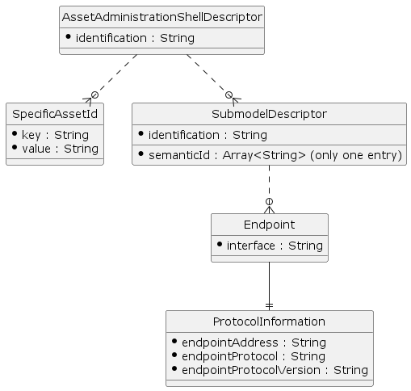
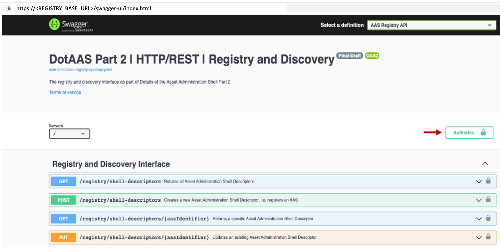
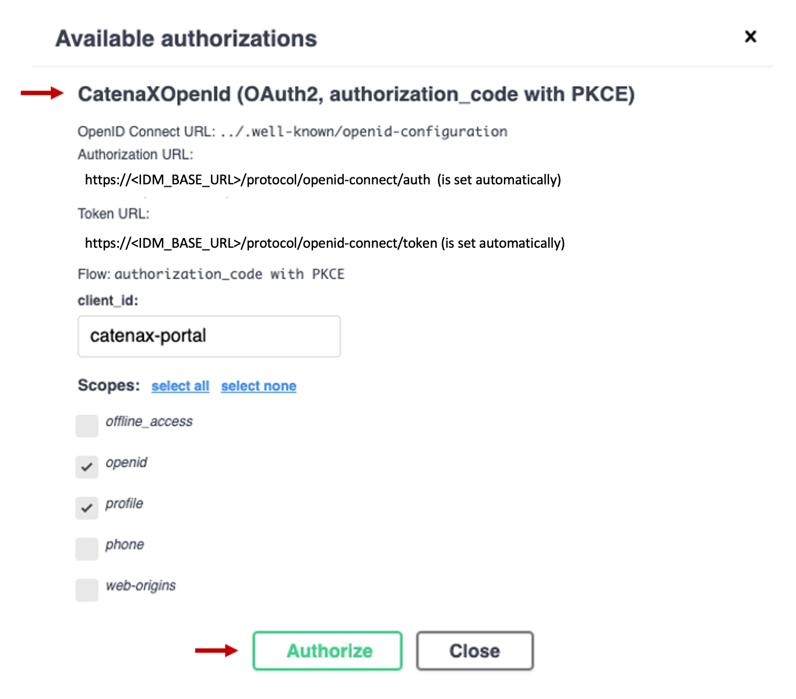
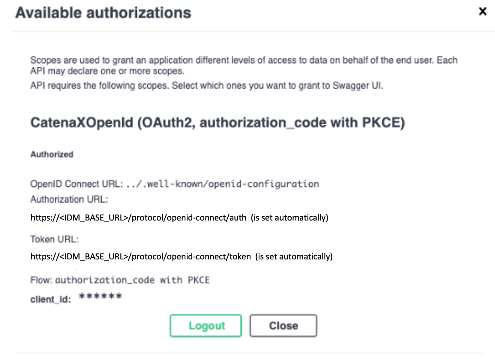

# Developer Documentation Tractus-X Digital Twin Registry
This page provides an overview of the Digital Twin Registry and all relevant information for developers to get started with integration against the Digital Twin Registry.

## Architectural Overview
The Digital Twin Registry acts as an address book for Digital Twins. Data Providers register their Digital Twins in the Digital Twin Registry. Data consumers query the Digital Twin Registry to find Digital Twins and interact with them further. A Digital Twin contains endpoint references to Submodel endpoints. Calling a Submodel endpoint returns data complaint to a semantic model. A semantic model describes the data that a Submodel endpoint returns.


## Asset Administration Shell Domain Model
The Asset Administration Shell Registry is an address book for Asset Administration Shell Descriptors. The diagram below, shows the domain model of the Asset Administration Shell Registry (AAS Registry).


The following table shows the synonyms for each of the domain objects above.

|Digital Twin Registry |  Asset Administration Shell Registry |
|---|---|
| DigitalTwin  | AssetAdministrationShellDescriptor  |
| Aspect  | SubmodelDescriptor  |
| LocalIdentifiers  | SpecificAssetIds  |


For the purpose of simplification the diagram above does only show the required fields. Below is the complete Asset Administration Shell Descriptor payload in JSON.

```
{
"description": [{
"language": "en",
"text": "The shell for a vehicle"
}],
"globalAssetId": {
"value": [
"c02729fe-915e-416c-9723-f2781627f3e2"
]
},
"idShort": "future concept x",
"identification": "882fc530-b69b-4707-95f6-5dbc5e9baaa8",
"specificAssetIds": [{
"key": "PartID",
"value": "12309481209312"
}],
"submodelDescriptors": [{
"identification": "urn:uuid:53125dc3-5e6f-4f4b-838d-447432b97918",
"idShort": "serialPartTypization",
"semanticId": {
"value": [
"urn:bamm:com.catenax.serial_part_typization:1.0.0"
]
},
"endpoints": [{
"interface": "EDC",
"protocolInformation": {
"endpointAddress": "edc://provider.connector:port/BPNL7588787849VQ/urn%3Auuid%3Ac227a880-b82b-40f7-846c-3942ddf26c29-urn%3Auuid%3A53125dc3-5e6f-4f4b-838d-447432b97918/submodel?content=value&extent=WithBLOBValue",
"endpointProtocol": "IDS/ECLIPSE DATASPACE CONNECTOR",
"endpointProtocolVersion": "0.0.1-SNAPSHOT"
}
}]
}]
}
```

## Actors and interaction diagrams
There are two actors who interact with the AAS Registry.

|Actor |  	Description | Examples |
|---|---|---|
| Data provider  | The data provider registers AAS Descriptors and Submodel Descriptors so that consumers can query for AAS Descriptors and request data via the Submodel Descriptor Endpoints. Responsibilities: Providing EDC compatible Submodel Descriptor Endpoints, Registration of the AAS Descriptors  | Any manufacturer who provides data for their assets |
| Data consumer  | 	The data consumer are accessing the AAS Registry to discover and consume data from the Submodel Descriptor Endpoints. Responsibilities: Query the AAS Registry for AAS Descriptors, Access the Submodel Descriptor Endpoints via EDC  |  |

The interactions of both actors are shown in the diagrams below.
For the purpose of simplifying, the interactions via EDC is not shown.

EDC is involved as following:
1. Interactions with the AAS Registry must not done with EDC
2. Interactions with Submodel Endpoints ( Data Provider ) have to be done with EDC

## Data provider
To be able to register a DigitalTwin the following prerequisites must be met.
1. The identifiers for an asset are known (specificAssetIds, e.g. serial number, part id)
2. An endpoint that provides the data for the asset is available. The data have to be complaint with an Aspect Model.

### Without EDC (simplified)


### With EDC


## Data consumer


## Uniqueness
The following table contains the identifier fields and wether they are globally unique, unique for an
AAS Descriptor or not unique at all.

| Field | Unique globally | Explanation |
|---|---|---|
| AssetAdministrationShellDescriptor#identification  | yes  | - |
| AssetAdministrationShellDescriptor#specificAssetIds#key	  | -  | The specificAssetIds are primarily used for searches. There are use cases where multiple values for the same key can exist. For instance, an OEM can have multiple World Manufacturer Identifier (WMI). Queries against any of the WMI must be possible as data consumers may know only one of the WMI.|
|  AssetAdministrationShellDescriptor#submodelDescriptor#identification  | yes  | - |


Uniqueness for natural keys e. g. serial numbers is not given in the manufacturing world.
Therefore the AAS Registry cannot enforce uniqueness for natural keys (specificAssetIds). 

## Identifiers

### Identification and globalAssetId

| Field | Value | Description |
|---|---|---|
| AssetAdministrationShellDescriptor#identification  | Random UUIDv4  | - |
| AssetAdministrationShellDescriptor#globalAssetId[0]  | Random UUIDv4  | The globalAssetId is a natural key that identifiers an asset uniquely. An example for instance is the MAC - Address. In the manufacturing industry not all assets do have a global unique natural key. It's was decided therefore to use a random UUID. |
| SubmodelDescriptor#identification  | Random UUIDv4  | - |


### Predefined specificAssetIds
The `specificAssetIds` are collection key-value pairs and the fundamental part for discovery capabilities of the AAS Registry. Data consumers use these specificAssetIds to find AAS Descriptors.
In multiple discussions with different Product Owners and architects, the keys for `specificAssetIds` were defined.
The AAS Registry does not enforce any `specificAssetId key`. However, data providers should use one of these keys if the Asset Administration Shell Descriptor does match one of the defined types e.g. Serial Part, Vehicle.
If you do not find a matching `specificAssetId` key for your use case please contact us so that we can extend the list.

## Submodel Descriptor Endpoints
   The Submodel Descriptor contains all the required information to obtain data from a remote address.
   The endpoint for a Submodel Descriptor must be setup as follows:

| Property | Description | Example Value | 
|---|---|---|
| interface  | The type of the endpoint. Only "EDC" is currently supported.  | EDC |
| semanticId  |	The urn of the Semantic Model that describes the data of this endpoint.  | urn:bamm:com.catenax:1.0.0#ExampleModel |
| protocolInformation#endpointAddress  | The EDC compatible endpoint where the semanticId compatible data can be fetched.  Catena-X  defined the URL structure as: Read Endpoint: http://<HOST>/<BPN>/<AAS_ID>-<SUBMODEL_ID>/submodel?content=value Operations Endpoint: <SAME_AS_READ/<operationName>/invoke?content=value | Read Endpoint: http://myawesomeconnector.com/BPNL7588787849VQ/urn%3Auuid%3Ac227a880-b82b-40f7-846c-3942ddf26c29-urn%3Auuid%3A53125dc3-5e6f-4f4b-838d-447432b97918/submodel?content=value&extent=WithBLOBValue
Operation Endpoint: http://myawesomeconnector.com/BPNL7588787849VQ/urn%3Auuid%3Ac227a880-b82b-40f7-846c-3942ddf26c29-urn%3Auuid%3A53125dc3-5e6f-4f4b-838d-447432b97918/submodel/vin-van-converter/invoke?content=value |
| protocolInformation#endpointProtocol  |  The protocol of the endpoint. | HTTPS |
|  protocolInformation#endpointProtocolVersion |  The version of the protocol. |  1.0|

   	

## Authentication & Authorization
   The AAS Registry is integrated with the IAM of Catena-X. Every API call have to provide a valid Bearer Token issued by Catena-X IAM.
   Authorization (roles & permissions) are not in place for Release 1.
   Authorization is supported by Role Based Access Control (RBAC). Following roles are available:

| Role | 	Description | 
|---|---|
| view_digital_twin | Can read all digital twins.|
|  add_digital_twin | Can add a digital twin.|
|  update_digital_twin |Can update a digital twin.Users can only update digital twins they own.
Ownership is ensured by the BPN of the user. |
| delete_digital_twin |Can delete a digital twin. Users can only delete digital twins they own.
Ownership is ensured by the BPN of the user.|
   
The Swagger UI of the AAS Registry is integrated with IAM. You can check the Swagger UI API calls for examples.

### Visibility of specificAssetIds based on BPN
You can control the visibility of specificAssetIds based the BPN.
- You can provide the BPN as attribute to a specificAssetId. Only users having the same BPN in the access token are able to see the specificAssetId.
- he specificAssetIds of Digital Twins you created will always be shown to you.

- Detailed example:
```
// Given specificAssetIds:

[{
"key": "CustomerPartId",
"value": "293913",
"externalSubjectId": {
"value": ["BPN12"]
}
}, {
"key": "CustomerPartId",
"value": "429212",
"externalSubjectId": {
"value": ["BPN49"]
}
}, {
"key": "CustomerPartId",
"value": "523192",
"externalSubjectId": {
"value": ["BPN29"]
}
}, {
"key": "MaterialNumber",
"value": "39192"
}]

// A customer with (BPN12) will only get the specificAssetIds that contains his BPN. Taking the above example, the response for the customer //(BPN12) would be:
[{
"key": "CustomerPartId",
"value": "293913",
"externalSubjectId": {
"value": ["BPN12"]
}
}, {
"key": "MaterialNumber",
"value": "39192"
}]

// Lookup API:  GET /shells/lookup and POST /shells/lookup/query with BPN12

// REQUEST:
[{
"key": "CustomerPartId",
"value": "429212" // note: the externalSubjectId of this assetId is BPN49
}]

// RESPONSE:
// The response is empty, because the above assetId belongs to customer (BPN49) and not to the  customer (BPN12).

[]
```

### Authentication on behalf of a user
The AAS Registry can accessed on behalf of a User. The Token have to be obtained via the Open-Id Connect flow. The AAS Registry will accept these tokens.

### Authentication via client credentials flow
The AAS Registry can also be accessed via a token obtained for a technical user.
If you do not have a technical user yet, please request one from Julia Jeroch . You have to provide at least the name of the Project / Application you are working on.
The postman collection AAS Registry Authentication contains an example for the client credentials flow.

| Variable | Value | 
|---|---|
| IDM_BASE_URL | https://centralidp.demo.catena-x.net/auth/realms/CX-Central/|
| YOUR_CLIENT_ID | request at Tractus-X portal team |
| YOUR_CLIENT_SECRET | request at Tractus-X portal team |


### Authentication with the Swagger UI
The Swagger UI is integrated with IAM.
If you do not have a IAM user yet, it needs to be requested by the IAM operator.
1.	Open the Swagger UI of the AAS Registry and click on the Authorize button on the right side



2. In the opened dialog, scroll to the flow
      CatenaXOpenId (OAuth2, authorization_code with PKCE) and click the Authorize button


3. There are two scenarios:
If you have already an active IAM session you will be logged in directly and should see the a Logout button in the Dialog:


4. If you do not have an active session, you will be redirected to the IAM. This is the same process as for the Portal UI. Choose "Microsoft" and enter your login information.
      After submitting, you will be redirected back to the Swagger UI.
5. Close the dialog, you can now start working with the AAS Registry API.

## Running the AAS Registry in Kubernetes (via Helm Charts)
   You can deploy the AAS Registry to your own Kubernetes cluster by using the helm charts in eclipse-tractus/sldt-digital-twin-registry.
   Please use the values.yaml below and update the values according to your needs.

| Variable | Value |  Notes |
|---|---|---|
| registry.image | 	e.g. ghcr.io/catenax-ng/registry:0.2.0-m1-multi-tenancy | 	If you need another docker image you can build it with the provided docker file |
| registry.host | minikube | Update this value to the domain to run the AAS Registry on. Example: semantics.int.demo.catena-x.net |
| registry.authentication | false | Disables authentication. |
|  registry.idpIssuerUri| "" | The URL of the Oauth2 provider. Takes effect if authentication is set to true. |

		

		
		

##  Running the AAS Registry locally (via Docker)
   The most convenient way use the AAS Registry locally is via the available Docker image in the Catena-X Azure Docker Registry.

1.     Create a new file docker-compose.yml with the below code:
Docker-Compose AAS Registry
```
version: "3.9"

services:

postgres:
image: postgres:13.6-alpine
container_name: postgres
ports:
- "5432:5432"
environment:
POSTGRES_PASSWORD: example
volumes:
- postgres-data:/var/lib/postgresql/data

aas_registry:
image: ghcr.io/catenax-ng/registry:0.2.0-m1-multi-tenancy
container_name: aas_registry
ports:
- "4243:4243"
environment:
SPRING_PROFILES_ACTIVE: local # disables security
SPRING_DATASOURCE_URL: jdbc:postgresql://host.docker.internal:5432/postgres
SPRING_DATASOURCE_DRIVER_CLASS_NAME: org.postgresql.Driver
SPRING_DATASOURCE_USERNAME: postgres
SPRING_DATASOURCE_PASSWORD: example

volumes:
postgres-data:
```

2.	Run docker-compose up -d
3.	Open the Swagger UI with this link: http://localhost:4243/swagger-ui/index.html
      GitHub Repository	GitHub Semantic Services


*Support contact*	tractusx-dev@eclipse.org


## Remarks
The Digital Twin Registry implementation is not 100 % specification compliant. Please find the current deviations in the below table.

| No | Deviation |  Reason |
|---|---|---|
| 1. | The field AssetAdministrationShellDescriptor#endpoints |  is optional in the AAS Registry implementation and will be ignored. |
| 2. | The response of the GET /registry/shell-descriptors was changed to support pagination. | Addressed as feedback to the AAS Specification |
| 3. | The POST /registry/shell-descriptors/batch endpoint was introduced to support the creation of AAS Descriptors in batch | Addressed as feedback to the AAS Specification |
| 4. | The specificAssetIds#SubjectIds field is optional and not supported. The AAS Registry ignores this field. |  |
| 5. | The POST /lookup/shells/query endpoint was introduced to support advanced query capabilities that are not yet defined in the specification | - |
