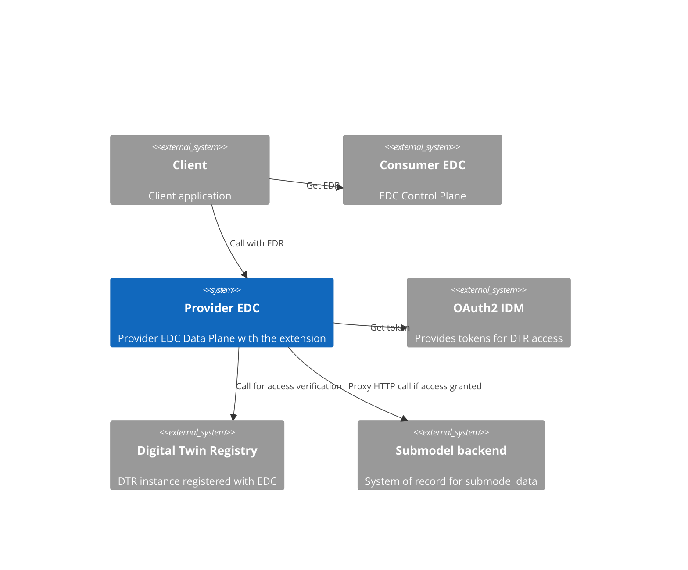
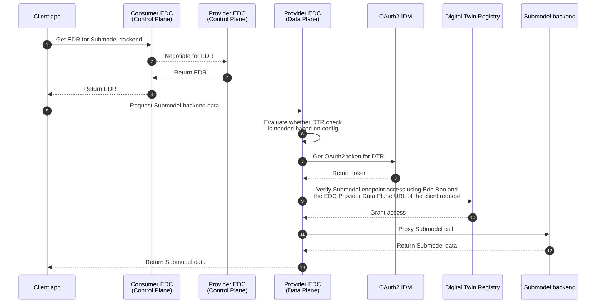
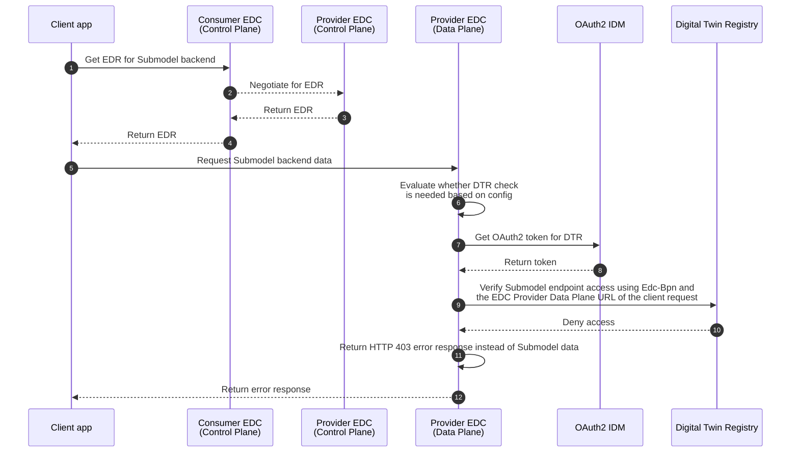
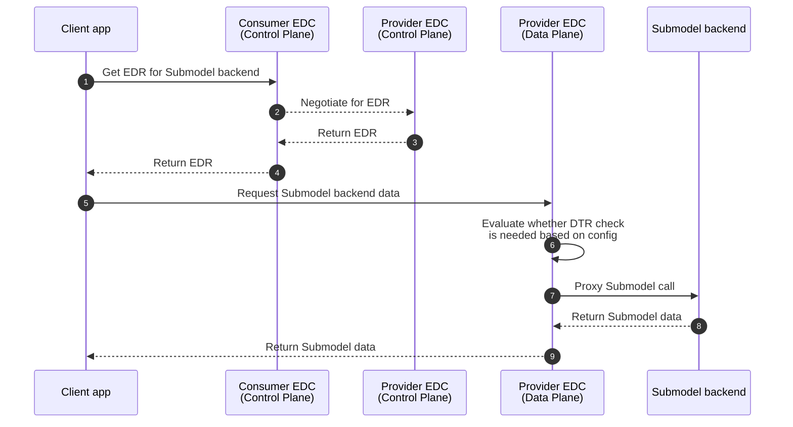

# Digital Twin Registry Data Plane HTTP Access Control Eclipse Dataspace Connector extension

## 1 Introduction and goals

The *Eclipse Dataspace Connector (EDC)* can provide access to many different backend services. These services have different security capabilities.

### High level requirement
The *Eclipse Dataspace Connector* extension can provide a granular access control solution for authorization of *Submodel* backend requests based on the registered
*Submodel* endpoints of the *Shells* which are available for the Data Consumer through the *Digital Twin Registry (DTR)*. 

### Requirements

- *Submodel* backends cannot be accessed through *Eclipse Dataspace Connector* unless:
   - their __exact URL__ is registered in the *Digital Twin Registry* as a *Submodel* endpoint `href`; AND
   - both the *Shell* containing the *Submodel* endpoint and the Submodels are visible to the Data Consumer.
- Multiple *Digital Twin Registry* instances might be registered for the same *Eclipse Dataspace Connector Data Plane* instance and *Eclipse Dataspace Connector* extension.
- The access control solution uses the already existing `Edc-Bpn` HTTP header, containing the *BPN* of the Data Consumer.
- The extension requires at least one registered *Digital Twin Registry* using granular access control ([as defined here](README.md#granular-access-control-implementation))

### Assumptions

- The provider *Control Plane EDC* includes the `Edc-Bpn` header in the `DataAddress`.

### Stakeholders

| Role          | Description                                             | Goal, Intention                      |
|---------------|---------------------------------------------------------|--------------------------------------|
| Data Consumer | uses the DTR                                            | wants to find endpoints for Shells   |
| Data Provider | runs its own DTR and provides endpoints to his Shells   | wants to provide Shells              |

## 2 Architecture and constraints

### System context (Logical view)



### Constraints
- The Data Provider must configure at least one *Digital Twin Registry* instance in order to use the *DTR Data Plane HTTP Access Control EDC extension*.
- The extension depends on the EDC Signaling API (no backport for legacy data access APIs)

## 3 Runtime-view

### Call sequences (Runtime view)

#### Prerequisites

In order to perform any of the following actions, we must assume that:

1. The *Digital Twin Registry* and the *Submodel* backend are both registered in *EDC* as assets
2. The *Submodel* backend asset configured to proxy the request path and query parameters
3. The client knows how to access the *Digital Twin Registry* through *EDC*
4. The client received the *Submodel* backend endpoint address from the *Digital Twin Registry* containing:
    1. The full *EDC Data Plane* URL including the proxied path and query parameters (if any) in `href`
    2. The Id of the *EDC* asset referencing the *Submodel* backend
    3. The provider *EDC control Plane's* URL
5. The *DTR Data Plane HTTP Access Control* extension is properly configured to call the *Digital Twin Registry* when the
   `DataAddress` URL points to an endpoint of the *Submodel* backend
6. The provider *Control Plane EDC* includes the `Edc-Bpn` header in the `DataAddress`


#### Happy case - The client has access to the protected *Submodel* resource

When the client has access to the protected *Submodel* details (based on the BPN and the *EDC Data Plane* request URL), then
the extension obtains an `OAuth2` access token for accessing the *Digital Twin Registry* to perform the additional access
verification step. The request is allowed through to the *Submodel* backend when the confirmation arrives from the *Digital
Twin Registry*. This flow can be seen below.



#### Exceptional case - The client has no access to the protected *Submodel* resource

When the client has NO access to the protected *Submodel* details (based on the *BPN* and the *EDC Data Plane* request URL),
then using the same flow, the extension will receive an error response form the *Digital Twin Registry* and as a result it
will not allow the *Submodel* request through by triggering a `HTTP 403` response from the *EDC*.



#### Happy case - The requested resource does not require *DTR* verification

Thanks to the configurable RegExp pattern controlling the access control mechanism, we can continue to use backends
which do not require additional granular access control measures. In this case, the request URL won't match the pattern
and the extension will neither obtain an `OAuth2` token nor call the *Digital Twin Registry* as seen below.



## 4 Configuration

### Prerequisites

1. A *Digital Twin Registry* configured to be using granular access control
2. Access to the *IDM* to create/configure a new user
3. The ability to add secrets to the Vault used by provider *EDC Data Plane*

### Required roles to access the *Digital Twin Registry* from the extension

The *Digital Twin Registry's* Submodel authorization API endpoint requires the `submodel_access_control` `OAuth2` role. The credentials used by *EDC* must be 
configured in the *IDM* to have this role.

> [!WARNING]
> It is recommended to use a set of credentials which are created specifically for this extension and only add the aforementioned `submodel_access_control` `OAuth2` role to limit the associated risk in case the credentials become compromised.

### Adding the credentials to the Vault

The client secret of the credentials must be added to the secrets manager (Vault) used by the *EDC Data Plane* instance using the extension. The alias/path of the 
secret will be required during the configuration. 

### Extension configuration

```properties
# Configure the URL which is used when the clients are reaching the EDC Data Plane's /public/v2/ endpoint 
edc.granular.access.verification.edc.data.plane.baseUrl=http://edc-data-plane:9051/public/v2/

# List the names of each DTR instance we intend to configure (comma separated list)
edc.granular.access.verification.dtr.names=default

# Configure each DTR instance using the following properties.
# "use the edc.granular.access.verification.dtr.config.<dtr_name>." prefix with each name listed above

# How long should we cache the response we have received from DTR?
edc.granular.access.verification.dtr.config.default.dtr.decision.cache.duration.minutes=1
# A RegExp pattern that can match the submodel endpoints in scope for DTR access control
edc.granular.access.verification.dtr.config.default.aspect.model.url.pattern=http:\/\/submodel:8080\/path\/.*
# The full URL of the access control verification endpoint of the DTR instance
edc.granular.access.verification.dtr.config.default.dtr.access.verification.endpoint.url=http://dtr:8080/aas-registry-api/v3.0/submodel-descriptor/authorized
# The OAuth2 configuration for accessing the DTR
# Token endpoint URL
edc.granular.access.verification.dtr.config.default.oauth2.token.endpoint.url=http://oauth2-iam:8080/iam/access-management/v1/tenants/00000000-0000-0000-0000-000000000000/openid-connect/token
# Scope (audience) of the token we want to obtain
edc.granular.access.verification.dtr.config.default.oauth2.token.scope=aud:dtr
# OAuth2 client Id
edc.granular.access.verification.dtr.config.default.oauth2.token.client.id=dtr_client
# The name (path) of the secret where the OAuth2 client secret is stored in the Vault
edc.granular.access.verification.dtr.config.default.oauth2.token.client.secret.path=dtrsecret
```

> [!NOTE]
> If none of these properties are configured, the extension is turned off.
