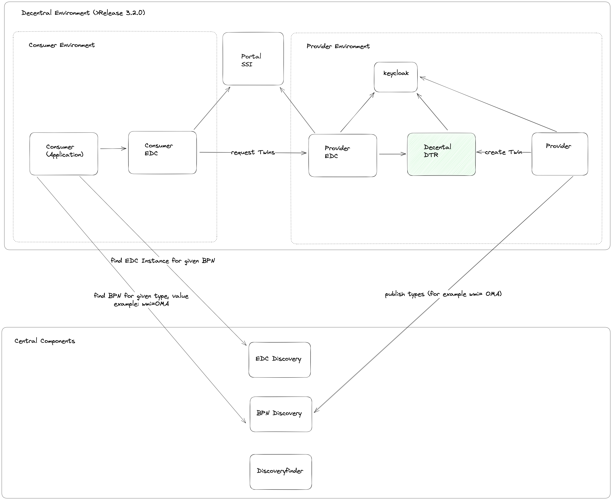
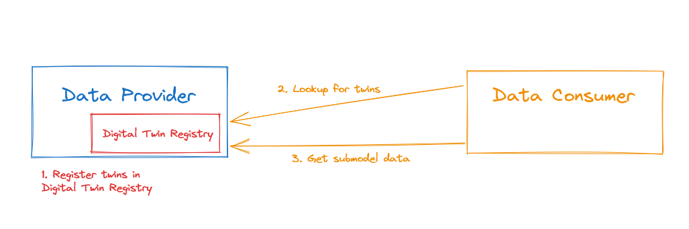
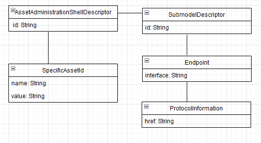
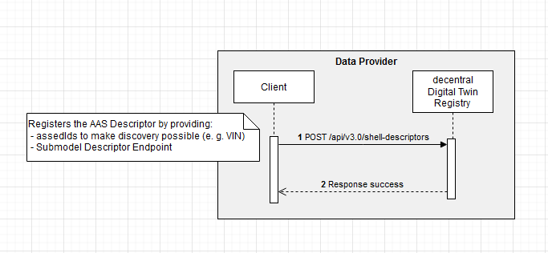
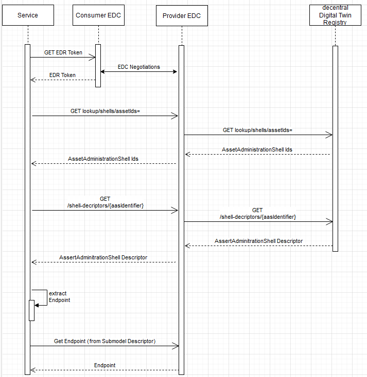

# Developer Documentation Tractus-X Digital Twin Registry
This page provides an overview of the Digital Twin Registry and all relevant information for developers to get started with integration against the Digital Twin Registry.

## 1 Introduction and goals
The Digital Twin Registry (DTR) acts as an address book for Digital Twins. Data Providers register their Digital Twins in the Digital Twin Registry. Data consumers query the Digital Twin Registry to find Digital Twins and interact with them further. A Digital Twin contains endpoint references to Submodel endpoints. Calling a Submodel endpoint returns data compliant to a semantic model. A semantic model describes the data that a Submodel endpoint returns.
The Digital Twin Registry is deployed as a decentralized component. That means that every Data Provider runs its own Digital Twin Registry.

### High level requirement
The DTR acts as an address book for finding Digital Twins.

### Quality goals

- Ensure that Digital Twins can be found.
- Data sovereignty is given. The provider is responsible for his data.
- All users and services are secured and can only access when authenticated and authorized.

### Stakeholders

| Role          | Description                                                  | Goal, Intention                           |
|---------------|--------------------------------------------------------------|-------------------------------------------|
| Data Consumer | uses the DTR                                                 | wants to find endpoints for Digital Twins |
| Data Provider | runs its own DTR and provides endpoints to his Digital Twins | wants to provide his twins                |


## 2 Architecture and constraints
A consumer is searching for an endpoint for a Digital Twin. For this he uses the DTR of a Data Provider.
Because now the DTR is deployed decentralized on each Data Provider side. There are some new services to help to find twins. 
The whole search and the embedding of the now decentralized Digital Twin is shown below:

### decentralized Digital Twin Registry environment



### Architectural Overview


## Asset Administration Shell Domain Model
The Asset Administration Shell Registry is an address book for Asset Administration Shell Descriptors. The diagram below, shows the domain model of the Asset Administration Shell Registry (AAS Registry).Only the main fields are shown.



The following table shows the synonyms for each of the domain objects above.

| Digital Twin Registry | Asset Administration Shell Registry |
|-----------------------|-------------------------------------|
| DigitalTwin           | AssetAdministrationShellDescriptor  |
| Aspect                | SubmodelDescriptor                  |
| LocalIdentifiers      | SpecificAssetIds                    |


For the purpose of simplification the diagram above does only show the required fields. Below is the complete Asset Administration Shell Descriptor payload in JSON.
```
{
  "description": [
    {
      "language": "en",
      "text": "complete shell example"
    }
  ],
  "displayName": [
    {
      "language": "en",
      "text": "shell example"
    }
  ],
  "assetKind": "Instance",
  "assetType": "AssetType",
  "globalAssetId": "c022729fe-416c-9723-f2781628fe2",
  "idShort": "shell example",
  "id": "69cfc420-8c1e-4212-b790-ed121820527f3",
  "specificAssetIds": [
    {
      "externalSubjectId": {
        "type": "ExternalReference",
        "keys": [
          {
            "type": "AssetAdministrationShell",
            "value": "TENANT_ONE"
          }
        ]
      },
      "semanticId": {
        "type": "ModelReference",
        "keys": [
          {
            "type": "AssetAdministrationShell",
            "value": "specificAssetIdReference key"
          }
        ]
      },
      "supplementalSemanticIds": [
        {
          "type": "ExternalReference",
          "keys": [
            {
              "type": "BasicEventElement",
              "value": "assetIdKey value"
            }
          ]
        }
      ],
      "name": "testname",
      "value": "testvalue"
    }
  ],
  "submodelDescriptors": [
    {
      "displayName": [
        {
          "language": "de",
          "text": "this is an example description1"
        }
      ],
      "endpoints": [
        {
          "interface": "interfaceNameExample",
          "protocolInformation": {
            "href": "edc://provider.connector:port/BPNL7588787849VQ/urn%3Auuid%3Ac227a880-b82b-40f7-846c-3942ddf26c29-urn%3Auuid%3A53125dc3-5e6f-4f4b-838d-447432b97918/submodel?content=value&extent=WithBLOBValue",
            "endpointProtocol": "endpointProtocolExample",
            "endpointProtocolVersion": [
              "e"
            ],
            "subprotocol": "subprotocolExample",
            "subprotocolBody": "subprotocolBodyExample",
            "subprotocolBodyEncoding": "subprotocolBodyExample",
            "securityAttributes": [
              {
                "type": "NONE",
                "key": "Security Attribute key",
                "value": "Security Attribute value"
              }
            ]
          }
        }
      ],
      "id": "dbf364c1-1215-43ca-98d4-f0a3d084120e3",
      "semanticId": {
        "type": "ExternalReference",
        "keys": [
          {
            "type": "Submodel",
            "value": "semanticIdExample"
          }
        ]
      },
      "supplementalSemanticId": [
        {
          "type": "ExternalReference",
          "keys": [
            {
              "type": "Submodel",
              "value": "supplementalsemanticIdExample value"
            }
          ]
        }
      ],
      "description": [
        {
          "language": "de",
          "text": "das ist beine Beispielbeschreibung"
        },
        {
          "language": "en",
          "text": "this is an example description"
        }
      ]
    }
  ]
}
```

### Constraints
- each Data Provider needs to run its own DTR in his environment. The DTR is not a central component anymore.
- Data Provider must provide his twins in its own DTR.
- To make requests to the DTR there are EDCs needed on Data Provider and Data Consumer side.

### Architecture Constraints
-   Developed under an open-source license and all used frameworks and
    libraries suites to this license.

-   Must be compliant and fulfill the Catena-X Guidelines.

-   An IDM system as an OAuth2 compliant authorization is needed to manage the identity and access of the user.

## 4 Runtime-view

### Actors and interaction diagrams
There are two actors who interact with the AAS Registry.

| Actor         | 	Description                                                                                                                                                                                                                                                                                                                                                     | Examples                                                                 |
|---------------|------------------------------------------------------------------------------------------------------------------------------------------------------------------------------------------------------------------------------------------------------------------------------------------------------------------------------------------------------------------|--------------------------------------------------------------------------|
| Data provider | The data provider runs its own Digital Twin Registry and registers AAS Descriptors and Submodel Descriptors so that consumers can query for AAS Descriptors and request data via the Submodel Descriptor Endpoints. Responsibilities: Run own Digital Twin Registry, providing EDC compatible Submodel Descriptor Endpoints, Registration of the AAS Descriptors | Any manufacturer who provides data for their assets and runs its own DTR |
| Data consumer | The data consumers are accessing the AAS Registry to discover and consume data from the Submodel Descriptor Endpoints. Responsibilities: Query the AAS Registry for AAS Descriptors, Access the Submodel Descriptor Endpoints via EDC                                                                                                                            |                                                                          |


The interactions of both actors are shown in the diagrams below.
For the purpose of simplifying, the interactions via EDC is not shown completely.

EDC is involved as following:
1. As a Data Provider to interact with the DTR there is no EDC needed.
2. As a Data Consumer for interactions the EDC is needed.
3. Interactions with Submodel Endpoints (Data Provider) have to be done with EDC

### Data provider
To be able to register a DigitalTwin the following prerequisites must be met.
1. The identifiers for an asset are known (specificAssetIds, e.g. serial number, part id)
2. An endpoint that provides the data for the asset is available. The data has to be compliant with an Aspect Model.
3. To register a twin no EDC is needed. But the DTR is secured by an IDM system, so to register a technical user is needed.

#### Register Twins (simplified without token management by IDM)



### Data Provider

#### Prerequisites
The Digital Twin Registry have to be accessed through an EDC. Following objects are needed to access the registry:

***1. Create Data Asset*** 
The EDC Data Assets represents the location of the Digital Twin Registry offered by the provider.

| API method     | URL: <PROVIDER_DATAMGMT_URL>/management/v2/assets (POST) |
|----------------|----------------------------------------------------|
| **Parameters** | none                                               |
| **Payload**    | see below                                          |
| **Returns**    | 200 / OK                                           |

***Data Asset*** 

_note:_ that the "asset:prop:type" is standardized with "data.core.digitalTwinRegistry" for the Digital Twin Registry.

```
{
    "@context": {},
    "asset": {
        "@type": "Asset",
        "@id": "{{ASSET_ID}}", 
        "properties": {
            "description": "",
            "type": "data.core.digitalTwinRegistry"
        }
    },
    "dataAddress": {
        "@type": "DataAddress",
        "type": "HttpData",
        "baseUrl": "{{BACKEND_SERVICE}}",
        "proxyPath": "true",
        "proxyBody": "true",
        "proxyMethod": "true",
        "proxyQueryParams": "true",
        "oauth2:clientId": "{{REGISTRY_CLIENT_ID}}",
        "oauth2:clientSecret": "{{REGISTRY_CLIENT_SECRET}}",
        "oauth2:tokenUrl": "{{REGISTRY_TOKEN_ENDPOINT}}",
        "oauth2:scope": "{{REGISTRY_TOKEN_SCOPE}}"
    }
}
```

***2. Create Policy***

The policy is the BPN policy to give the consumer access to the asset.

   | API method     | URL: <PROVIDER_DATAMGMT_URL>/management/v2/policydefinitions (POST) |
   |----------------|---------------------------------------------------|
   | **Parameters** | none                                              |
   | **Payload**    | see below                                         |
   | **Returns**    | 200 / OK                                          |

***EDC Policy***

```
{
    "@context": {
        "odrl": "http://www.w3.org/ns/odrl/2/"
    },
    "@type": "PolicyDefinitionRequestDto",
    "@id": "{{POLICY_ID}}",
    "policy": {
		"@type": "Policy",
		"odrl:permission" : [{
			"odrl:action" : "USE",
			"odrl:constraint" : {
				"@type": "LogicalConstraint",
				"odrl:or" : [{
					"@type" : "Constraint",
					"odrl:leftOperand" : "BusinessPartnerNumber",
					"odrl:operator" : {
                        "@id": "odrl:eq"
                    },
					"odrl:rightOperand" : "{{CONSUMER_BPN}}"
				}]
			}
		}]
    }
}
```

***3. Create Contract Definition***

The contract definition links the created policy with the created asset. 

   | API method     | URL: <PROVIDER_DATAMGMT_URL>/management/v2/contractdefinitions (POST) | 
   |----------------|--------------------------------------------------------------|
   | **Parameters** | none                                                         |
   | **Payload**    | see below                                                    |
   | **Returns**    | 200 / OK                                                     |


***Contract Definition***

```
{
    "@context": {},
    "@id": "{{CONTRACT_DEFINITION_ID}}",
    "@type": "ContractDefinition",
    "accessPolicyId": "{{ACCESS_POLICY_ID}}",
    "contractPolicyId": "{{CONTRACT_POLICY_ID}}",
    "assetsSelector" : {
        "@type" : "CriterionDto",
        "operandLeft": "{{EDC_NAMESPACE}}id",
        "operator": "=",
        "operandRight": "{{ASSET_ID}}"
    }
}
```

***4. Negotiation***

At last both EDCs do the final negotiation and the consumer EDC receives the edr token to get access to the Digital Twin Registry.


#### Search for Twins (simplified)



## 5 Deployment-view

For Deployment needed:

-   Webserver
-   Kubernetes-Cluster
-   Helm

To deploy this system, you need to use the Helm Chart in a running
Kubernetes cluster. The Helm Chart is located under "charts/registry".
In case you don't have a running cluster, you can set up one by yourself
locally, using minikube. For further information checkout the [readme.md](https://github.com/eclipse-tractusx/sldt-digital-twin-registry/blob/main/README.md).

## 6 Concept

### Overall Concept

The overall concept can be found under **2 Architecture and constraints**.

### Visibility of specificAssetIds based on tenantId/BPN
The visibility of `specificAssetIds` in the Digital Twin Registry based on the Business Partner Number (BPN) can be controlled with the attribute `externalSubjectId`. Hence, the `externalSubjectId` is identified with the BPN.

* The BPN as attribute to a *specificAssetId* can be provided in `specificAssetIds`. This can be done with `externalSubjectId`.
* Only users, who have the same BPN in the Eclipse Dataspace Components-BPN Header are able to see content of `specificAssetIds`.
* The behavior is closed by default, *i.e.*, if no `externalSubjectId` is defined to a `specificAssetId`, the content of this particular `specificAssetId` (key, value) is only visible for the owner of the twin (also known as data provider).
* To mark a `specificAssetId` as public for every reader on a *Digital Twin*, the defined character (`"PUBLIC_READABLE"`) needs to be added in the `externalSubjectId`.
* The communication between consumer and provider is via EDC. Before the provider EDC sends the request to the DTR, the property Edc-Bpn with the BPN of the consumer will be set by the provider EDC.
* The specificAssetIds of Digital Twins you created will always be shown to you.

Detailed example:
```
// Given specificAssetIds:
  "specificAssetIds":[
      {
         "name":"partInstanceId",
         "value":"24975539203421"
      },
      {
         "name":"customerPartId",
         "value":"231982",
         "externalSubjectId":{
            "type":"ExternalReference",
            "keys":[
               {
                  "type":"GlobalReference",
                  "value":"BPN_COMPANY_001"
               }
            ]
         }
      },
      {
         "name":"manufacturerPartId",
         "value":"123829238",
         "externalSubjectId":{
            "type":"ExternalReference",
            "keys":[
		       {
                  "type":"GlobalReference",
                  "value":"PUBLIC_READABLE"
               }
            ]
         }
      }
   ]
```
This example is a *Digital Twin* with three different `specificAssetIds` as descriptors.
* `partInstanceID` is only visible for the owner of the twin, since <u>no</u> `externalSubjectId` is defined.
* `customerPartId` is only visible for the owner of the twin and an (external) reader via EDC, who has the bpn-value "BPN_COMPANY_001" in the header of the EDC
* `manufacturerPartId` is visible for everyone, because the `externalSubjectId` has the wildcard value `"PUBLIC_READABLE"` included.

For example, if an (external) reader via EDC requests the here shown *Digital Twin* and the edc-bpn header includes the bpn-value "BPN_COMPANY_001", the list of `specificAssetIds` contains two entries, namely:
* `customerPartId`, because its `externalSubjectId` matches to the incoming bpn-value "BPN_COMPANY_001"
* `manufacturerPartId`, because this `specificAssetId` has the `externalSubjectId = "PUBLIC_READABLE"` and therefore is public for everyone

In this example, the `specificAssetId` `"name": "partInstanceId"` is filtered out, because it is only visible for the owner of the *Digital Twin*.

### Asset Administration Shell specification 
The Digital Twin Registry has implemented Asset Administration Shell specification in version 3.0.
The corresponding openapi file can be found here: "backend/src/main/resources/static/aas-registry-openapi.yaml"

### Uniqueness
The following table contains the identifier fields and whether they are globally unique, unique for an
AAS Descriptor or not unique at all.

| Field                                                    | Unique globally | Explanation                                                                                                                                                                                                                                                                                             |
|----------------------------------------------------------|-----------------|---------------------------------------------------------------------------------------------------------------------------------------------------------------------------------------------------------------------------------------------------------------------------------------------------------|
| AssetAdministrationShellDescriptor#id                    | yes             | -                                                                                                                                                                                                                                                                                                       |
| AssetAdministrationShellDescriptor#specificAssetIds#key	 | -               | The specificAssetIds are primarily used for searches. There are use cases where multiple values for the same key can exist. For instance, an OEM can have multiple World Manufacturer Identifier (WMI). Queries against any of the WMI must be possible as data consumers may know only one of the WMI. |
| AssetAdministrationShellDescriptor#submodelDescriptor#id | yes             | -                                                                                                                                                                                                                                                                                                       |

Uniqueness for natural keys e.g. serial numbers is not given in the manufacturing world.
Therefore, the AAS Registry cannot enforce uniqueness for natural keys (specificAssetIds).

### Identifiers

#### Identification and globalAssetId

| Field                                               | Value         | Description                                                                                                                                                                                                                                          |
|-----------------------------------------------------|---------------|------------------------------------------------------------------------------------------------------------------------------------------------------------------------------------------------------------------------------------------------------|
| AssetAdministrationShellDescriptor#id               | Random UUIDv4 | -                                                                                                                                                                                                                                                    |
| AssetAdministrationShellDescriptor#globalAssetId[0] | Random UUIDv4 | The globalAssetId is a natural key that identifies an asset uniquely. An example for instance is the MAC - Address. In the manufacturing industry not all assets do have a global unique natural key. It was decided therefore to use a random UUID. |
| SubmodelDescriptor#id                               | Random UUIDv4 | -                                                                                                                                                                                                                                                    |


### Predefined specificAssetIds
The `specificAssetIds` are collection key-value pairs and the fundamental part for discovery capabilities of the AAS Registry. Data consumers use these specificAssetIds to find AAS Descriptors.
In multiple discussions with different Product Owners and architects, the keys for `specificAssetIds` were defined.
The AAS Registry does not enforce any `specificAssetId key`. However, data providers should use one of these keys if the Asset Administration Shell Descriptor does match one of the defined types e.g. Serial Part, Vehicle.
If you do not find a matching `specificAssetId` key for your use case please contact us so that we can extend the list.

### Submodel Descriptor Endpoints
The Submodel Descriptor contains all the required information to obtain data from a remote address.
The endpoint for a Submodel Descriptor must be setup as follows:

| Property                                                                                                                                                                                                               | Description                                                                                                                                                                                                                                                                        | Example Value                                                                                                                                                                                                 | 
|------------------------------------------------------------------------------------------------------------------------------------------------------------------------------------------------------------------------|------------------------------------------------------------------------------------------------------------------------------------------------------------------------------------------------------------------------------------------------------------------------------------|---------------------------------------------------------------------------------------------------------------------------------------------------------------------------------------------------------------|
| interface                                                                                                                                                                                                              | The type of the endpoint. Only "EDC" is currently supported.                                                                                                                                                                                                                       | EDC                                                                                                                                                                                                           |
| semanticId                                                                                                                                                                                                             | 	The urn of the Semantic Model that describes the data of this endpoint.                                                                                                                                                                                                           | urn:bamm:com.catenax:1.0.0#ExampleModel                                                                                                                                                                       |
| protocolInformation#href                                                                                                                                                                                               | The EDC compatible endpoint where the semanticId compatible data can be fetched.  Catena-X  defined the URL structure as: Read Endpoint: http://<HOST>/<BPN>/<AAS_ID>-<SUBMODEL_ID>/submodel?content=value Operations Endpoint: <SAME_AS_READ/<operationName>/invoke?content=value | Read Endpoint: http://myawesomeconnector.com/BPNL7588787849VQ/urn%3Auuid%3Ac227a880-b82b-40f7-846c-3942ddf26c29-urn%3Auuid%3A53125dc3-5e6f-4f4b-838d-447432b97918/submodel?content=value&extent=WithBLOBValue |
| Operation Endpoint: http://myawesomeconnector.com/BPNL7588787849VQ/urn%3Auuid%3Ac227a880-b82b-40f7-846c-3942ddf26c29-urn%3Auuid%3A53125dc3-5e6f-4f4b-838d-447432b97918/submodel/vin-van-converter/invoke?content=value |                                                                                                                                                                                                                                                                                    |                                                                                                                                                                                                               |
| protocolInformation#endpointProtocol                                                                                                                                                                                   | The protocol of the endpoint.                                                                                                                                                                                                                                                      | HTTPS                                                                                                                                                                                                         |
| protocolInformation#endpointProtocolVersion                                                                                                                                                                            | The version of the protocol.                                                                                                                                                                                                                                                       | 1.0                                                                                                                                                                                                           |

### Authentication & Authorization
The AAS Registry needs to be integrated with an OAuth2 compliant authorization server. Every API call has to provide a valid Bearer Token issued by this authorization server.
Authorization is supported by Role Based Access Control (RBAC). Following roles are available:

| Role                | 	Description                                                                                                                   | 
|---------------------|--------------------------------------------------------------------------------------------------------------------------------|
| view_digital_twin   | Can read all digital twins.                                                                                                    |
| add_digital_twin    | Can add a digital twin.                                                                                                        |
| update_digital_twin | Can update a digital twin.  |
| delete_digital_twin | Can delete a digital twin. |

Depending on being a Data Provider or a Data Consumer there are different tokens for authentication and authorization needed.
#### Data Provider
1. technical user for the service which administrates the Digital Twin Registry
2. technical user for the EDC which makes the requests in behalf of the Data Consumer to the DTR.

#### Data Consumer
1. needs an EDR token which is provided between the intercommunication between the EDCs.

### Authentication on behalf of a user
The AAS Registry can be accessed on behalf of a user. The token has to be obtained via the OpenID Connect flow. The AAS Registry will validate these tokens.

#### Postman configuration


*Support contact*	tractusx-dev@eclipse.org

## 7 Quality scenarios

### Quality Requirements

| Tool       | Description                                                                                                                                                                                                                                              |
|------------|----------------------------------------------------------------------------------------------------------------------------------------------------------------------------------------------------------------------------------------------------------|
| Veracode   | "Veracode enables you to quickly and cost-effectively scan software for flaws and get actionable source code analysis results." [Link](https://www.veracode.com)                                                                                         |
| Trivy      | "Trivy is a simple and comprehensive vulnerability/misconfiguration/secret scanner for containers and other artifacts. Trivy detects vulnerabilities of OS packages and language-specific packages." [Link](https://aquasecurity.github.io/trivy/v0.34/) |
| SonarCloud | "SonarCloud's static analysis detects Bugs and Code Smells in your repositories and provides the feedback you need to write better code." [Link](https://www.sonarsource.com/products/sonarcloud/)                                                       |


## Glossary

| Term          | Description                                                                                                    |
|---------------|----------------------------------------------------------------------------------------------------------------|
| EDC           | Eclipse Data Space Connector                                                                                   |
| DTR           | Digital Twin Registry - the phone book to register and to search for endpoints for Digital Twins               |
| dDTR          | decentralized Digital Twin Registry - the Digital Twin Registry which is deployed on each Data Provider system |
| Data Provider | deploys a own Digital Twin Registry and provides the data for his digital twins                                |
| Data Consumer | uses the Digital Twin Registry to search for digital twins                                                     |
| IDM           | User identity management e.g. Keycloak                                                                         |

## Remarks
The Digital Twin Registry implementation is not 100 % specification compliant.

### NOTICE

This work is licensed under the [Apache-2.0](https://www.apache.org/licenses/LICENSE-2.0).

- SPDX-License-Identifier: Apache-2.0
- SPDX-FileCopyrightText: 2023 Robert Bosch Manufacturing Solutions GmbH
- SPDX-FileCopyrightText: 2023 Contributors to the Eclipse Foundation
- Source URL: https://github.com/eclipse-tractusx/sldt-digital-twin-registry.git