# Developer Documentation Tractus-X Digital Twin Registry
This page provides an overview of the Digital Twin Registry and all relevant information for developers to get started with integration against the Digital Twin Registry.

## 1 Introduction and goals
The Digital Twin Registry (DTR) acts as an address book for Digital Twins. Data Providers register their Digital Twins in the Digital Twin Registry. Data consumers query the Digital Twin Registry to find Digital Twins and interact with them further. A Digital Twin contains endpoint references to Submodel endpoints. Calling a Submodel endpoint returns data compliant to a semantic model. A semantic model describes the data that a Submodel endpoint returns.
The Digital Twin Registry is deployed as a decentralized component. That means that every Data Provider runs its own Digital Twin Registry.

### High level requirement
The DTR acts as an address book for finding Digital Twins.

### Quality goals

- Ensure that Digital Twins can be found.
- Data sovereignty is given. The provider is responsible for his data.
- All users and services are secured and can only access when authenticated and authorized.

### Stakeholders

| Role          | Description                                                  | Goal, Intention                           |
|---------------|--------------------------------------------------------------|-------------------------------------------|
| Data Consumer | uses the DTR                                                 | wants to find endpoints for Digital Twins |
| Data Provider | runs its own DTR and provides endpoints to his Digital Twins | wants to provide his twins                |


## 2 Architecture and constraints
A consumer is searching for an endpoint for a Digital Twin. For this he uses the DTR of a Data Provider.
Because now the DTR is deployed decentralized on each Data Provider side. There are some new services to help to find twins. 
The whole search and the embedding of the now decentralized Digital Twin is shown below:

### Architectural Overview- Decentralized Digital Twin Registry environment


## Asset Administration Shell Domain Model
The Asset Administration Shell Registry is an address book for Asset Administration Shell Descriptors. The diagram below, shows the domain model of the Asset Administration Shell Registry (AAS Registry).Only the main fields are shown.


The following table shows the synonyms for each of the domain objects above.

| Digital Twin Registry | Asset Administration Shell Registry |
|-----------------------|-------------------------------------|
| DigitalTwin           | AssetAdministrationShellDescriptor  |
| Aspect                | SubmodelDescriptor                  |
| LocalIdentifiers      | SpecificAssetIds                    |


For the purpose of simplification the diagram above does only show the required fields. Below is the complete Asset Administration Shell Descriptor payload in JSON.
```
{
  "description": [
    {
      "language": "en",
      "text": "complete shell example"
    }
  ],
  "displayName": [
    {
      "language": "en",
      "text": "shell example"
    }
  ],
  "assetKind": "Instance",
  "assetType": "AssetType",
  "globalAssetId": "c022729fe-416c-9723-f2781628fe2",
  "idShort": "shell example",
  "id": "69cfc420-8c1e-4212-b790-ed121820527f3",
  "specificAssetIds": [
    {
      "externalSubjectId": {
        "type": "ExternalReference",
        "keys": [
          {
            "type": "AssetAdministrationShell",
            "value": "TENANT_ONE"
          }
        ]
      },
      "semanticId": {
        "type": "ModelReference",
        "keys": [
          {
            "type": "AssetAdministrationShell",
            "value": "specificAssetIdReference key"
          }
        ]
      },
      "supplementalSemanticIds": [
        {
          "type": "ExternalReference",
          "keys": [
            {
              "type": "BasicEventElement",
              "value": "assetIdKey value"
            }
          ]
        }
      ],
      "name": "testname",
      "value": "testvalue"
    }
  ],
  "submodelDescriptors": [
    {
      "displayName": [
        {
          "language": "de",
          "text": "this is an example description1"
        }
      ],
      "endpoints": [
        {
          "interface": "interfaceNameExample",
          "protocolInformation": {
            "href": "edc://provider.connector:port/BPNL7588787849VQ/urn%3Auuid%3Ac227a880-b82b-40f7-846c-3942ddf26c29-urn%3Auuid%3A53125dc3-5e6f-4f4b-838d-447432b97918/submodel?content=value&extent=WithBLOBValue",
            "endpointProtocol": "endpointProtocolExample",
            "endpointProtocolVersion": [
              "e"
            ],
            "subprotocol": "subprotocolExample",
            "subprotocolBody": "subprotocolBodyExample",
            "subprotocolBodyEncoding": "subprotocolBodyExample",
            "securityAttributes": [
              {
                "type": "NONE",
                "key": "Security Attribute key",
                "value": "Security Attribute value"
              }
            ]
          }
        }
      ],
      "id": "dbf364c1-1215-43ca-98d4-f0a3d084120e3",
      "semanticId": {
        "type": "ExternalReference",
        "keys": [
          {
            "type": "Submodel",
            "value": "semanticIdExample"
          }
        ]
      },
      "supplementalSemanticId": [
        {
          "type": "ExternalReference",
          "keys": [
            {
              "type": "Submodel",
              "value": "supplementalsemanticIdExample value"
            }
          ]
        }
      ],
      "description": [
        {
          "language": "de",
          "text": "das ist beine Beispielbeschreibung"
        },
        {
          "language": "en",
          "text": "this is an example description"
        }
      ]
    }
  ]
}
```

### Constraints
- each Data Provider needs to run its own DTR in his environment. The DTR is not a central component anymore.
- Data Provider must provide his twins in its own DTR.
- To make requests to the DTR there are EDCs needed on Data Provider and Data Consumer side.

### Architecture Constraints
-   Developed under an open-source license and all used frameworks and
    libraries suites to this license.

-   Must be compliant and fulfill the Catena-X Guidelines.

-   An IDM system as an OAuth2 compliant authorization is needed to manage the identity and access of the user.

## 4 Runtime-view

### Actors and interaction diagrams
There are two actors who interact with the AAS Registry.

| Actor         | 	Description                                                                                                                                                                                                                                                                                                                                                     | Examples                                                                 |
|---------------|------------------------------------------------------------------------------------------------------------------------------------------------------------------------------------------------------------------------------------------------------------------------------------------------------------------------------------------------------------------|--------------------------------------------------------------------------|
| Data provider | The data provider runs its own Digital Twin Registry and registers AAS Descriptors and Submodel Descriptors so that consumers can query for AAS Descriptors and request data via the Submodel Descriptor Endpoints. Responsibilities: Run own Digital Twin Registry, providing EDC compatible Submodel Descriptor Endpoints, Registration of the AAS Descriptors | Any manufacturer who provides data for their assets and runs its own DTR |
| Data consumer | The data consumers are accessing the AAS Registry to discover and consume data from the Submodel Descriptor Endpoints. Responsibilities: Query the AAS Registry for AAS Descriptors, Access the Submodel Descriptor Endpoints via EDC                                                                                                                            |                                                                          |


The interactions of both actors are shown in the diagrams below.
For the purpose of simplifying, the interactions via EDC is not shown completely.

EDC is involved as following:
1. As a Data Provider to interact with the DTR there is no EDC needed.
2. As a Data Consumer for interactions the EDC is needed.
3. Interactions with Submodel Endpoints (Data Provider) have to be done with EDC

### Data provider
To be able to register a DigitalTwin the following prerequisites must be met.
1. The identifiers for an asset are known (specificAssetIds, e.g. serial number, part id)
2. An endpoint that provides the data for the asset is available. The data has to be compliant with an Aspect Model.
3. To register a twin no EDC is needed. But the DTR is secured by an IDM system, so to register a technical user is needed.

#### Register Twins (simplified without token management by IDM)


### Data Provider

#### Prerequisites
The Digital Twin Registry have to be accessed through an EDC. Following objects are needed to access the registry:

***1. Create Data Asset*** 
The EDC Data Assets represents the location of the Digital Twin Registry offered by the provider.

| API method     | URL: <PROVIDER_DATAMGMT_URL>/management/v2/assets (POST) |
|----------------|----------------------------------------------------|
| **Parameters** | none                                               |
| **Payload**    | see below                                          |
| **Returns**    | 200 / OK                                           |

***Data Asset*** 

_note:_ that the "asset:prop:type" is standardized with "data.core.digitalTwinRegistry" for the Digital Twin Registry.

```
{
    "@context": {},
    "asset": {
        "@type": "Asset",
        "@id": "{{ASSET_ID}}", 
        "properties": {
            "description": "",
            "type": "data.core.digitalTwinRegistry"
        }
    },
    "dataAddress": {
        "@type": "DataAddress",
        "type": "HttpData",
        "baseUrl": "{{BACKEND_SERVICE}}",
        "proxyPath": "true",
        "proxyBody": "true",
        "proxyMethod": "true",
        "proxyQueryParams": "true",
        "oauth2:clientId": "{{REGISTRY_CLIENT_ID}}",
        "oauth2:clientSecret": "{{REGISTRY_CLIENT_SECRET}}",
        "oauth2:tokenUrl": "{{REGISTRY_TOKEN_ENDPOINT}}",
        "oauth2:scope": "{{REGISTRY_TOKEN_SCOPE}}"
    }
}
```

***2. Create Policy***

The policy is the BPN policy to give the consumer access to the asset.

   | API method     | URL: <PROVIDER_DATAMGMT_URL>/management/v2/policydefinitions (POST) |
   |----------------|---------------------------------------------------|
   | **Parameters** | none                                              |
   | **Payload**    | see below                                         |
   | **Returns**    | 200 / OK                                          |

***EDC Policy***

```
{
    "@context": {
        "odrl": "http://www.w3.org/ns/odrl/2/"
    },
    "@type": "PolicyDefinitionRequestDto",
    "@id": "{{POLICY_ID}}",
    "policy": {
		"@type": "Policy",
		"odrl:permission" : [{
			"odrl:action" : "USE",
			"odrl:constraint" : {
				"@type": "LogicalConstraint",
				"odrl:or" : [{
					"@type" : "Constraint",
					"odrl:leftOperand" : "BusinessPartnerNumber",
					"odrl:operator" : {
                        "@id": "odrl:eq"
                    },
					"odrl:rightOperand" : "{{CONSUMER_BPN}}"
				}]
			}
		}]
    }
}
```

***3. Create Contract Definition***

The contract definition links the created policy with the created asset. 

   | API method     | URL: <PROVIDER_DATAMGMT_URL>/management/v2/contractdefinitions (POST) | 
   |----------------|--------------------------------------------------------------|
   | **Parameters** | none                                                         |
   | **Payload**    | see below                                                    |
   | **Returns**    | 200 / OK                                                     |


***Contract Definition***

```
{
    "@context": {},
    "@id": "{{CONTRACT_DEFINITION_ID}}",
    "@type": "ContractDefinition",
    "accessPolicyId": "{{ACCESS_POLICY_ID}}",
    "contractPolicyId": "{{CONTRACT_POLICY_ID}}",
    "assetsSelector" : {
        "@type" : "CriterionDto",
        "operandLeft": "{{EDC_NAMESPACE}}id",
        "operator": "=",
        "operandRight": "{{ASSET_ID}}"
    }
}
```

***4. Negotiation***

At last both EDCs do the final negotiation and the consumer EDC receives the edr token to get access to the Digital Twin Registry.


#### Search for Twins (simplified)

## 5 Deployment-view

For Deployment needed:

-   Webserver
-   Kubernetes-Cluster
-   Helm

To deploy this system, you need to use the Helm Chart in a running
Kubernetes cluster. The Helm Chart is located under "charts/registry".
In case you don't have a running cluster, you can set up one by yourself
locally, using minikube. For further information checkout the [readme.md](https://github.com/eclipse-tractusx/sldt-digital-twin-registry/blob/main/README.md).

## 6 Concept

### Overall Concept

The overall concept can be found under **2 Architecture and constraints**.

### Asset Administration Shell specification 
The Digital Twin Registry has implemented Asset Administration Shell specification in version 3.0.
The corresponding openapi file can be found here: "backend/src/main/resources/static/aas-registry-openapi.yaml"

### Uniqueness
The following table contains the identifier fields and whether they are globally unique, unique for an
AAS Descriptor or not unique at all.

| Field                                                    | Unique globally | Explanation                                                                                                                                                                                                                                                                                             |
|----------------------------------------------------------|-----------------|---------------------------------------------------------------------------------------------------------------------------------------------------------------------------------------------------------------------------------------------------------------------------------------------------------|
| AssetAdministrationShellDescriptor#id                    | yes             | -                                                                                                                                                                                                                                                                                                       |
| AssetAdministrationShellDescriptor#specificAssetIds#key	 | -               | The specificAssetIds are primarily used for searches. There are use cases where multiple values for the same key can exist. For instance, an OEM can have multiple World Manufacturer Identifier (WMI). Queries against any of the WMI must be possible as data consumers may know only one of the WMI. |
| AssetAdministrationShellDescriptor#submodelDescriptor#id | yes             | -                                                                                                                                                                                                                                                                                                       |

Uniqueness for natural keys e.g. serial numbers is not given in the manufacturing world.
Therefore, the AAS Registry cannot enforce uniqueness for natural keys (specificAssetIds).

### Identifiers

#### Identification and globalAssetId

| Field                                               | Value         | Description                                                                                                                                                                                                                                          |
|-----------------------------------------------------|---------------|------------------------------------------------------------------------------------------------------------------------------------------------------------------------------------------------------------------------------------------------------|
| AssetAdministrationShellDescriptor#id               | Random UUIDv4 | -                                                                                                                                                                                                                                                    |
| AssetAdministrationShellDescriptor#globalAssetId[0] | Random UUIDv4 | The globalAssetId is a natural key that identifies an asset uniquely. An example for instance is the MAC - Address. In the manufacturing industry not all assets do have a global unique natural key. It was decided therefore to use a random UUID. |
| SubmodelDescriptor#id                               | Random UUIDv4 | -                                                                                                                                                                                                                                                    |


### Predefined specificAssetIds
The `specificAssetIds` are collection key-value pairs and the fundamental part for discovery capabilities of the AAS Registry. Data consumers use these specificAssetIds to find AAS Descriptors.
In multiple discussions with different Product Owners and architects, the keys for `specificAssetIds` were defined.
The AAS Registry does not enforce any `specificAssetId key`. However, data providers should use one of these keys if the Asset Administration Shell Descriptor does match one of the defined types e.g. Serial Part, Vehicle.
If you do not find a matching `specificAssetId` key for your use case please contact us so that we can extend the list.

### Submodel Descriptor Endpoints
The Submodel Descriptor contains all the required information to obtain data from a remote address.
The endpoint for a Submodel Descriptor must be setup as follows:

| Property                                                                                                                                                                                                               | Description                                                                                                                                                                                                                                                                        | Example Value                                                                                                                                                                                                 | 
|------------------------------------------------------------------------------------------------------------------------------------------------------------------------------------------------------------------------|------------------------------------------------------------------------------------------------------------------------------------------------------------------------------------------------------------------------------------------------------------------------------------|---------------------------------------------------------------------------------------------------------------------------------------------------------------------------------------------------------------|
| interface                                                                                                                                                                                                              | The type of the endpoint. Only "EDC" is currently supported.                                                                                                                                                                                                                       | EDC                                                                                                                                                                                                           |
| semanticId                                                                                                                                                                                                             | 	The urn of the Semantic Model that describes the data of this endpoint.                                                                                                                                                                                                           | urn:bamm:com.catenax:1.0.0#ExampleModel                                                                                                                                                                       |
| protocolInformation#href                                                                                                                                                                                               | The EDC compatible endpoint where the semanticId compatible data can be fetched.  Catena-X  defined the URL structure as: Read Endpoint: http://<HOST>/<BPN>/<AAS_ID>-<SUBMODEL_ID>/submodel?content=value Operations Endpoint: <SAME_AS_READ/<operationName>/invoke?content=value | Read Endpoint: http://myawesomeconnector.com/BPNL7588787849VQ/urn%3Auuid%3Ac227a880-b82b-40f7-846c-3942ddf26c29-urn%3Auuid%3A53125dc3-5e6f-4f4b-838d-447432b97918/submodel?content=value&extent=WithBLOBValue |
| Operation Endpoint: http://myawesomeconnector.com/BPNL7588787849VQ/urn%3Auuid%3Ac227a880-b82b-40f7-846c-3942ddf26c29-urn%3Auuid%3A53125dc3-5e6f-4f4b-838d-447432b97918/submodel/vin-van-converter/invoke?content=value |                                                                                                                                                                                                                                                                                    |                                                                                                                                                                                                               |
| protocolInformation#endpointProtocol                                                                                                                                                                                   | The protocol of the endpoint.                                                                                                                                                                                                                                                      | HTTPS                                                                                                                                                                                                         |
| protocolInformation#endpointProtocolVersion                                                                                                                                                                            | The version of the protocol.                                                                                                                                                                                                                                                       | 1.0                                                                                                                                                                                                           |

### Authentication & Authorization
The AAS Registry needs to be integrated with an OAuth2 compliant authorization server. Every API call has to provide a valid Bearer Token issued by this authorization server.
Authorization is supported by Role Based Access Control (RBAC). Following roles are available:

| Role                    | Description                                              | 
|-------------------------|----------------------------------------------------------|
| view_digital_twin       | Can read all digital twins.                              |
| add_digital_twin        | Can add a digital twin.                                  |
| update_digital_twin     | Can update a digital twin.                               |
| delete_digital_twin     | Can delete a digital twin.                               |
| submodel_access_control | Can perform submodel access control authorization calls. |
| read_access_rules       | Can read the rules defined for access control.           |
| write_access_rules      | Can write the rules defined for access control.          |

Depending on being a Data Provider or a Data Consumer there are different tokens for authentication and authorization needed.
#### Data Provider
1. technical user for the service which administrates the Digital Twin Registry
2. technical user for the EDC which makes the requests in behalf of the Data Consumer to the DTR.

#### Data Consumer
1. needs an EDR token which is provided between the intercommunication between the EDCs.

### Authentication on behalf of a user
The AAS Registry can be accessed on behalf of a user. The token has to be obtained via the OpenID Connect flow. The AAS Registry will validate these tokens.
*Support contact*	tractusx-dev@eclipse.org

### Access control to Digital Twins Based on the BPN (Business Partner Number)/ TenantId

#### Classic implementation

The visibility of `specificAssetIds` in the Digital Twin Registry based on the Business Partner Number (BPN) (Which is send via header Edc-Bpn) can be controlled with the attribute `externalSubjectId`. Hence, the `externalSubjectId` is identified with the BPN. 
The communication between consumer and provider is via EDC. Before the provider EDC sends the request to the DTR, the property Edc-Bpn with the BPN of the consumer will be set by the provider EDC.


* The BPN as attribute to a *specificAssetId* can be optionally provided in `specificAssetIds`. This can be done with `externalSubjectId`.
* Only those users, where `externalSubjectId` matches the Eclipse Dataspace Components-Header (Edc-Bpn -> *i.e.* BPN) are able to discover and read exactly this content of `specificAssetIds`.
* The behavior is **closed by default**, *i.e.*, if no `externalSubjectId` is defined to a `specificAssetId`, the content of this particular `specificAssetId` (key, value) is only visible for the owner of the *Digital Twin* (also known as data provider).
* To mark a `specificAssetId` as public for every reader on a *Digital Twin*, the defined characters (`"PUBLIC_READABLE"`) need to be added in the `externalSubjectId`.
   * *Cave: The publisher of `specificAssetIds` needs to consider antitrust law. This use of `"PUBLIC_READABLE"` is only allowed for the *specificAssetId* `"assetLifecyclePhase"` and `"manufacturerPartId"` (which is technically enforced by the Digital Twin Registry) if its content describes material numbers of products and those products are or were in serial production for the open market. If its content describes material numbers of products in state of, *e.g.*, pre-production, being planned for production, being unsold, the use of `"PUBLIC_READABLE"` is not allowed and use of dedicated read access via  `externalSubjectId` is to be used instead. `"manufacturerPartId"` is not allowed to be used for different content than the one described here.*
* The behavior of the Digital Twin Registry is as follows. The read-access from `specificAssetIds` is inherited by the other fields of a *Digital Twin*.
   * An owner and a user with respect to the BPN, who has read-access to one of the `specificAssetIds` (`externalSubjectId` has `"value":"<Business Partner Number>"`) has read-access to the other fields of a *Digital Twin* as well, *i.e.* (see the full list of fields [POST Asset Administration Shell Descriptor v3.0 SSP-001](https://app.swaggerhub.com/apis/Plattform_i40/AssetAdministrationShellRegistryServiceSpecification/V3.0_SSP-001#/Asset%20Administration%20Shell%20Registry%20API/PostAssetAdministrationShellDescriptor))
      * `description`
      * `displayName`
      * `administration`
      * `assetKind`
      * `assetType`
      * `globalAssetId`
      * `idShort`
      * `id`
      * `submodelDescriptors`
      * `specificAssetIds`

   * A user, who has <u>only</u> general read-access to `specificAssetIds` (`externalSubjectId` has `"value":"PUBLIC_READABLE"`) has <u>only</u> read-access to the following fields of a *Digital Twin*
      * `id`
      * `submodelDescriptors`
      * `specificAssetIds`
   * The list of `keys` in the externalSubjectId is filtered for the requested user. Only the keys will be returned where the BPN matched.

**Hint** <br>
The defined string for `"PUBLIC_READABLE"` and the list of allowed types to mark as public is configurable via helm values.yml:
* `registry.externalSubjectIdWildcardPrefix` (Default is `"PUBLIC_READABLE"` )
* `registry.externalSubjectIdWildcardAllowedTypes` (Default is `"manufacturerPartId,assetLifecyclePhase"` )

Detailed information can be found [here](../INSTALL.md)
_________________


Example to create a *Digital Twin* with `specificAssetIds`:
```
POST Method:
{{registry-baseurl}}/api/v3/shell-descriptors
```

```json
POST Body (JSON):
{
   "idShort":"idShortExample",
   "id":"e1eba3d7-91f0-4dac-a730-eaa1d35e035c-2",
   "description":[
      {
         "language":"en",
         "text":"Example of human readable description of digital twin."
      }
   ],
   "specificAssetIds":[
      {
         "name":"partInstanceId",
         "value":"24975539203421"
      },
      {
         "name":"customerPartId",
         "value":"231982",
         "externalSubjectId":{
            "type":"ExternalReference",
            "keys":[
               {
                  "type":"GlobalReference",
                  "value":"BPN_COMPANY_001"
               }
            ]
         }
      },
      {
         "name":"manufacturerId",
         "value":"123829238",
         "externalSubjectId":{
            "type":"ExternalReference",
            "keys":[
               {
                  "type":"GlobalReference",
                  "value":"BPN_COMPANY_001"
               },
               {
                  "type":"GlobalReference",
                  "value":"BPN_COMPANY_002"
               }
            ]
         }
      },
      {
         "name":"manufacturerPartId",
         "value":"231982",
         "externalSubjectId":{
            "type":"ExternalReference",
            "keys":[
               {
                  "type":"GlobalReference",
                  "value":"PUBLIC_READABLE"
               }
            ]
         }
      }
   ],
   "submodelDescriptors":[
      {
         "endpoints":[
            {
               "interface":"SUBMODEL-3.0",
               "protocolInformation":{
                  "href":"https://edc.data.plane/mypath/submodel",
                  "endpointProtocol":"HTTP",
                  "endpointProtocolVersion":[
                     "1.1"
                  ],
                  "subprotocol":"DSP",
                  "subprotocolBody":"body with information required by subprotocol",
                  "subprotocolBodyEncoding":"plain",
                  "securityAttributes":[
                     {
                        "type":"NONE",
                        "key": "NONE",
                        "value": "NONE"
                     }
                  ]
               }
            }
         ],
         "idShort":"idShortExample",
         "id":"cd47615b-daf3-4036-8670-d2f89349d388-2",
         "semanticId":{
            "type":"ExternalReference",
            "keys":[
               {
                  "type":"Submodel",
                  "value":"urn:bamm:io.catenax.serial_part_typization:1.1.0#SerialPartTypization"
               }
            ]
         },
         "description":[
            {
               "language":"de",
               "text":"Beispiel einer lesbaren Beschreibung des Submodels."
            },
            {
               "language":"en",
               "text":"Example of human readable description of submodel"
            }
         ]
      }
   ]
}
```
This example is a *Digital Twin* with four different `specificAssetIds` as descriptors.
* `partInstanceID` is discoverable and visible only for the owner of the *Digital Twin*, since <u>no</u> `externalSubjectId` is defined.
* `customerPartId` is discoverable and visible only for the owner of the *Digital Twin* and an (external) reader via EDC, who has the bpn-value "BPN_COMPANY_001" in the header of the EDC
* `manufacturerId` is discoverable and visible only for the owner of the *Digital Twin* and two (external) readers via EDC, who have the bpn-value "BPN_COMPANY_001" and "BPN_COMPANY_002" in the header of the EDC
* `manufacturerPartId` is discoverable and visible for everyone, who has access to the Digital Twin Registry, because the `externalSubjectId` has the value `"PUBLIC_READABLE"` included.

For example, if an (external) reader via EDC requests the here shown *Digital Twin* and the edc-bpn header includes the bpn-value "BPN_COMPANY_001", the list of `specificAssetIds` contains three entries, namely:
* `customerPartId`
* `manufacturerId`
* `manufacturerPartId`

In consequence, the reader "BPN_COMPANY_001", as well as the reader "BPN_COMPANY_002" and the owner of this *Digital Twin* has full read access to the other fields of this *Digital Twin*, *i.e.* `idShort`, `id`, `description`, and `submodelDescriptors`.

In this example, the `specificAssetId` `"name": "partInstanceId"` is filtered out, because it is only visible for the owner of the *Digital Twin*.

Any (external) readers with respect to the `"PUBLIC_READABLE"` flag at `specificAssetId` `"name": "manufacturerPartId"`, have access to the fields
* `id`
* `submodelDescriptors`

of this *Digital Twin*.

#### Granular access control implementation

The granular access control implementation is provided as an alternative option to enforce visibility rules of the *Digital Twin* details. These can be:

1. The visibility of the *Digital Twin* as a whole
2. The visibility of certain `specificAssetId` names and values of the *Digital Twin*
3. The visibility of certain `submodelDescriptors` of the *Digital Twin*
4. Restricting access to *Digital Twin* details which are `"PUBLIC_READABLE"` 
   (only showing the `id`, the public readable `specificAssetId` names and values, the `createdDate` and the filtered `submodelDescriptors` )

##### Configuring granular access control

To enable granular access control (instead of the classic implementation), the `registry.useGranularAccessControl` configuration HELM chart property must be set to `"true"`.
This will in turn set `registry.use-granular-access-control` Spring property to `true`, which will activate the granular access control.

In addition to the aforementioned property, we can set the number of records fetched when listing records. This can be done by setting the 
`registry.granularAccessControlFetchSize` HELM chart property. The default value is `"500"`. Providing this property will set the `registry.granular-access-control-fetch-size` 
Spring property of the Digital Twin Registry to the equivalent int value. In general, the higher we can set this value, the fewer fetches will be required when shells are 
listed and filtered. It is recommended to use at least 1000 if the registry has more than 100 000 Digital Twins.

##### Creating an access rule

The access rules can be managed using the provided access rule API ([See API specs here](../access-control-service-sql-impl/src/main/resources/static/access-control-openapi.yaml)).

> [!NOTE] 
> In order to use the API, the client must have the `read_access_rules` and `write_access_rules` roles.

Please refer to the following table to get familiar with the schema of the access rules.

| Property    | Type     | Required on create | Description                                                                            |
|-------------|----------|--------------------|----------------------------------------------------------------------------------------|
| id          | long     | No (read-only)     | The auto-incremented Id of the rule.                                                   |
| tid         | string   | No (read-only)     | The Id of the owner tenant (the owner of the Digital Twin Registry).                   |
| policyType  | enum     | Yes                | Defines the policy language used for the rule's policy. Possible values: `AAS`.        |
| policy      | json     | Yes                | The definition of the access rule.                                                     |
| description | string   | No (optional)      | An short, optional description or note to help with the maintenance of the rule.       |
| validFrom   | datetime | No (optional)      | An optional timestamp representing the earlier time when the rule should be in effect. |
| validTo     | datetime | No (optional)      | An optional timestamp representing the latest time when the rule should be in effect.  |

An example policy:

```json
{
   "id": 1,
   "tid": "00000000-1111-2222-3333-444444444444",
   "policyType": "AAS",
   "policy": {
      "accessRules": [
         {
            "attribute": "bpn",
            "operator": "eq",
            "value": "BPNL00000000000A"
         },
         {
            "attribute": "mandatorySpecificAssetIds",
            "operator": "includes",
            "values": [
               {
                  "attribute": "manufacturerPartId",
                  "operator": "eq",
                  "value": "99991"
               },
               {
                  "attribute": "customerPartId",
                  "operator": "eq",
                  "value": "ACME001"
               }
            ]
         },
         {
            "attribute": "visibleSpecificAssetIdNames",
            "operator": "includes",
            "values": [
               {
                  "attribute": "name",
                  "operator": "eq",
                  "value": "manufacturerPartId"
               },
               {
                  "attribute": "name",
                  "operator": "eq",
                  "value": "customerPartId"
               },
               {
                  "attribute": "name",
                  "operator": "eq",
                  "value": "partInstanceId"
               }
            ]
         },
         {
            "attribute": "visibleSemanticIds",
            "operator": "includes",
            "values": [
               {
                  "attribute": "modelUrn",
                  "operator": "eq",
                  "value": "Traceabilityv1.1.0"
               },
               {
                  "attribute": "modelUrn",
                  "operator": "eq",
                  "value": "ProductCarbonFootprintv1.1.0"
               }
            ]
         }
      ]
   },
   "description": "Access rule description.",
   "validFrom": "2024-01-02T03:04:05Z",
   "validTo": "2024-06-07T08:09:10Z"
}
```

The example policy above can be split into multiple parts when read.

1. Validity - It is valid between `2024-01-02T03:04:05Z` and `2024-06-07T08:09:10Z`. Otherwise, it is ignored.
2. Scope - Outlining when a rule is applicable.
    1. The first access rule (`$.policy.accessRules[0]`) defines the *bpn* (*externalSubjectId*) of the tenant to whom the policy applies.
    2. The second access rule (`$.policy.accessRules[1]`) defines the *mandatorySpecificAssetIds* which must be present in the *Digital Twin* in order for the rule to be applicable. The rule will become applicable only if __all__ *specificAssetId* name-value pairs of the rule are present in the *Digital Twin*.
3. Effect - Defines which parts of the matching *Digital Twins* should be visible when the client's *externalSubjectId* matches the rule's.
    1. The third access rule (`$.policy.accessRules[2]`) defines the *visibleSpecificAssetIdNames*. These are the names of the *specificAssetIds* from the *Digital Twin* which should be visible when the rule matches.
    2. The fourth access rule (`$.policy.accessRules[3]`) defines the *visibleSemanticIds*. These *semanticIds* are identifying the *submodelDescriptors* from the *Digital Twin* which should be visible when the rule matches.

##### How the rule evaluation works?

In general, when a shell's visibility is evaluated, we must: 

1. Take the *externalSubjectId* of the client, the *ownerTenantId* of the *Digital Twin Registry* and the contents of the *Digital Twin* in question.
2. If the *externalSubjectId* is equal to the *ownerTenantId*, the client can see the full content.
3. Otherwise, we must fetch all access rules which belong to the client's *externalSubjectId* or `PUBLIC_READABLE`; and is in the specified validity period
4. Then, for each *specificAssetId* of the *Digital Twin*, we must verify whether there is at least one applicable rule that gives access to the *specificAssetId* of the *Digital Twin*. 
5. Similarly, for each *submodelDescriptor* of the *Digital Twin*, we must verify whether there is at least one applicable rule that gives access to the *semanticId* of the *submodelDescriptor* from the *Digital Twin*.

The process acn be summed up in a more visual way as shown in the diagram below:


###### Lookup shells - `GET {{baseUrl}}/api/v3/lookup/shells?assetIds=...`

In case of the lookup shells, the filtering and access control of the *Digital Twins* is done using the following steps:

1. A page (fetchSize) of *Digital Twins* is loaded which are matching the client's query expression.
2. The list of shells fetched in the previous step is filtered by applying the access control rules to them one-by-one.
3. The process is repeated until we have the desired number of *Digital Twins* or there are no more *Digital Twins* to fetch.
4. The AAS Ids of the visible *Digital Twins* are returned.

###### Get all shells - `GET {{baseUrl}}/api/v3/shell-descriptors`

The process is similar to the lookup shells, the filtering and access control of the *Digital Twins* is done as follows:

1. A page (fetchSize) of *Digital Twins* is loaded.
2. The list of shells fetched in the previous step is filtered by applying the access control rules to them one-by-one.
3. The process is repeated until we have the desired number of *Digital Twins* or there are no more *Digital Twins* to fetch.
4. The visible properties of the visible *Digital Twins* are returned.

###### Get Shell by AAS Id - `GET {{baseUrl}}/api/v3/shell-descriptors/:aasIdentifier`

To determine the visibility of a single *Digital Twin*, we can simply:

1. Fetch the *Digital Twin*
2. Apply the access control rules using the process defined at the beginning of this section
3. Return the visible parts of the *Digital Twin* (or empty result in case the *Digital Twin* is not visible at all)

#### Public readable

When a *Digital Twin* is only visible because there are applicable `PUBLIC_READABLE` rules which make certain properties visible,
the shell details are further limited. This means, that we are returning only:

- the `id`,
- the `idEsternal` (*AAS Id*),
- the public readable `specificAssetId` names and values,
- the `createdDate`
- the filtered `submodelDescriptors`


## 7 Quality scenarios

### Quality Requirements

| Tool       | Description                                                                                                                                                                                                                                              |
|------------|----------------------------------------------------------------------------------------------------------------------------------------------------------------------------------------------------------------------------------------------------------|
| Veracode   | "Veracode enables you to quickly and cost-effectively scan software for flaws and get actionable source code analysis results." [Link](https://www.veracode.com)                                                                                         |
| Trivy      | "Trivy is a simple and comprehensive vulnerability/misconfiguration/secret scanner for containers and other artifacts. Trivy detects vulnerabilities of OS packages and language-specific packages." [Link](https://aquasecurity.github.io/trivy/v0.34/) |
| SonarCloud | "SonarCloud's static analysis detects Bugs and Code Smells in your repositories and provides the feedback you need to write better code." [Link](https://www.sonarsource.com/products/sonarcloud/)                                                       |

## Security Assessment

Data flow diagram:

```mermaid
%%{init: {"flowchart": {"curve": "linear"} }}%%
graph TB
    CD[Consumer Data]
    CE[Consumer EDC]
    PE[Provider EDC]
    DP[Data Provider]
    IDM[IDM]
    DTR-B[DTR Backend]
    DTR-P[DTR Postgres]

    subgraph Provider Env
    PE
    DP
    IDM
    subgraph Digital Twin Registry
        DTR-B
        DTR-P
    end
    end

    CD <-->|X-API auth key \n return twin| CE
    CE <-->|EDC flow \n certificate based auth \n provide role| PE

    PE -->|Get token| IDM
    DP -->|Get token| IDM
    DTR-B -->|Get public key \n token validation| IDM

    PE <-->|Get twin & submodel| DTR-B
    DP <-->|Register twin & submodel| DTR-B
    DTR-B <-->|Create twin & submodel| DTR-P
```



## Glossary

| Term          | Description                                                                                                    |
|---------------|----------------------------------------------------------------------------------------------------------------|
| EDC           | Eclipse Data Space Connector                                                                                   |
| DTR           | Digital Twin Registry - the phone book to register and to search for endpoints for Digital Twins               |
| dDTR          | decentralized Digital Twin Registry - the Digital Twin Registry which is deployed on each Data Provider system |
| Data Provider | deploys a own Digital Twin Registry and provides the data for his digital twins                                |
| Data Consumer | uses the Digital Twin Registry to search for digital twins                                                     |
| IDM           | User identity management e.g. Keycloak                                                                         |

## Remarks
The Digital Twin Registry implementation is not 100 % specification compliant.

### NOTICE

This work is licensed under the [Apache-2.0](https://www.apache.org/licenses/LICENSE-2.0).

- SPDX-License-Identifier: Apache-2.0
- SPDX-FileCopyrightText: 2023 Robert Bosch Manufacturing Solutions GmbH
- SPDX-FileCopyrightText: 2023 Contributors to the Eclipse Foundation
- Source URL: https://github.com/eclipse-tractusx/sldt-digital-twin-registry.git
