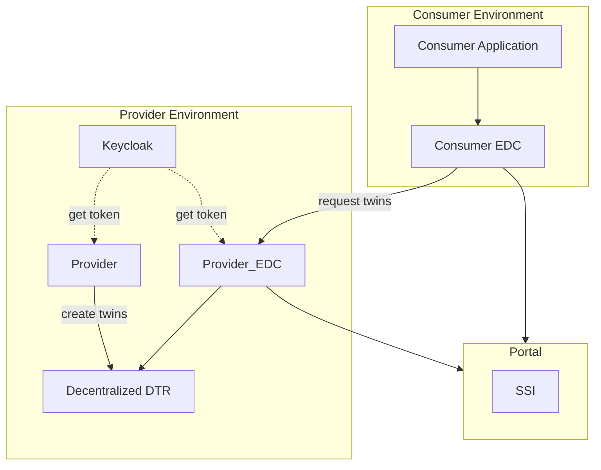
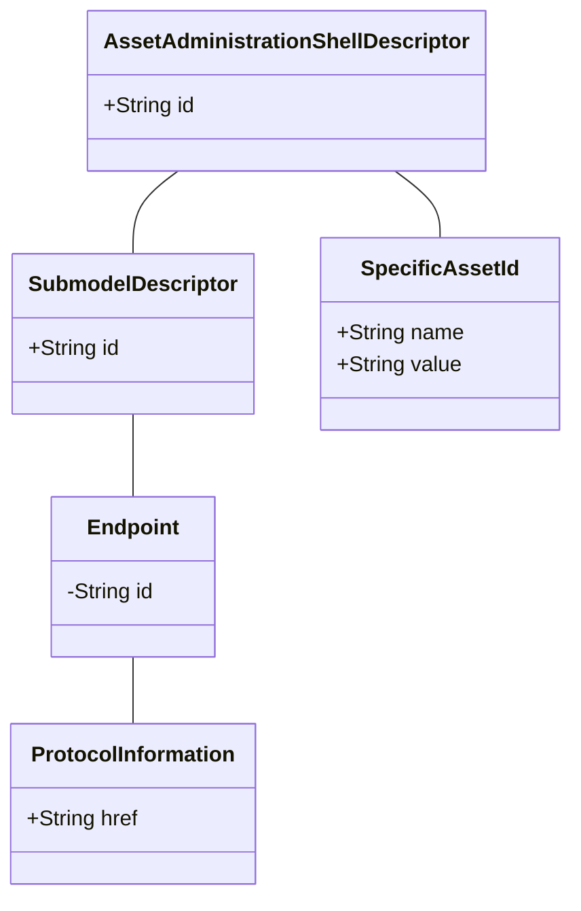

## 2 Architecture and constraints
A consumer is searching for an endpoint for a Digital Twin. For this the user uses the DTR of a Data Provider, because the DTR is deployed decentralized on each Data Provider side. 
There are some new services to help to find twins.
The whole search and the embedding of the decentralized Digital Twin is shown below:

### Architectural Overview- Decentralized Digital Twin Registry environment


### Asset Administration Shell Domain Model
The Asset Administration Shell Registry is an address book for Asset Administration Shell Descriptors. The diagram below, shows the domain model of the Asset Administration Shell Registry (AAS Registry).Only the main fields are shown.


The following table shows the synonyms for each of the domain objects above.

| Digital Twin Registry | Asset Administration Shell Registry |
|-----------------------|-------------------------------------|
| DigitalTwin           | AssetAdministrationShellDescriptor  |
| Aspect                | SubmodelDescriptor                  |
| LocalIdentifiers      | SpecificAssetIds                    |


For the purpose of simplification the diagram above does only show the required fields. Below is the complete Asset Administration Shell Descriptor payload in JSON.
```
{
  "description": [
    {
      "language": "en",
      "text": "complete shell example"
    }
  ],
  "displayName": [
    {
      "language": "en",
      "text": "shell example"
    }
  ],
  "assetKind": "Instance",
  "assetType": "AssetType",
  "globalAssetId": "c022729fe-416c-9723-f2781628fe2",
  "idShort": "shell example",
  "id": "69cfc420-8c1e-4212-b790-ed121820527f3",
  "specificAssetIds": [
    {
      "externalSubjectId": {
        "type": "ExternalReference",
        "keys": [
          {
            "type": "AssetAdministrationShell",
            "value": "TENANT_ONE"
          }
        ]
      },
      "semanticId": {
        "type": "ModelReference",
        "keys": [
          {
            "type": "AssetAdministrationShell",
            "value": "specificAssetIdReference key"
          }
        ]
      },
      "supplementalSemanticIds": [
        {
          "type": "ExternalReference",
          "keys": [
            {
              "type": "BasicEventElement",
              "value": "assetIdKey value"
            }
          ]
        }
      ],
      "name": "testname",
      "value": "testvalue"
    }
  ],
  "submodelDescriptors": [
    {
      "displayName": [
        {
          "language": "de",
          "text": "this is an example description1"
        }
      ],
      "endpoints": [
        {
          "interface": "interfaceNameExample",
          "protocolInformation": {
            "href": "edc://provider.connector:port/BPNL7588787849VQ/urn%3Auuid%3Ac227a880-b82b-40f7-846c-3942ddf26c29-urn%3Auuid%3A53125dc3-5e6f-4f4b-838d-447432b97918/submodel?content=value&extent=WithBLOBValue",
            "endpointProtocol": "endpointProtocolExample",
            "endpointProtocolVersion": [
              "e"
            ],
            "subprotocol": "subprotocolExample",
            "subprotocolBody": "subprotocolBodyExample",
            "subprotocolBodyEncoding": "subprotocolBodyExample",
            "securityAttributes": [
              {
                "type": "NONE",
                "key": "Security Attribute key",
                "value": "Security Attribute value"
              }
            ]
          }
        }
      ],
      "id": "dbf364c1-1215-43ca-98d4-f0a3d084120e3",
      "semanticId": {
        "type": "ExternalReference",
        "keys": [
          {
            "type": "Submodel",
            "value": "semanticIdExample"
          }
        ]
      },
      "supplementalSemanticId": [
        {
          "type": "ExternalReference",
          "keys": [
            {
              "type": "Submodel",
              "value": "supplementalsemanticIdExample value"
            }
          ]
        }
      ],
      "description": [
        {
          "language": "de",
          "text": "das ist beine Beispielbeschreibung"
        },
        {
          "language": "en",
          "text": "this is an example description"
        }
      ]
    }
  ]
}
```

### Constraints
- each Data Provider needs to run its own DTR in his environment. The DTR is not a central component anymore.
- Data Provider must provide his twins in its own DTR.
- To make requests to the DTR there are EDCs needed on Data Provider and Data Consumer side.

### Architecture Constraints
- Developed under an open-source license and all used frameworks and
    libraries suites to this license.

- Must be compliant and fulfill the Catena-X Guidelines.

- An IDM system as an OAuth2 compliant authorization is needed to manage the identity and access of the user.

### NOTICE

This work is licensed under the [Apache-2.0](https://www.apache.org/licenses/LICENSE-2.0).

- SPDX-License-Identifier: Apache-2.0
- SPDX-FileCopyrightText: 2024 Robert Bosch Manufacturing Solutions GmbH
- SPDX-FileCopyrightText: 2024 Contributors to the Eclipse Foundation
- Source URL: https://github.com/eclipse-tractusx/sldt-digital-twin-registry.git