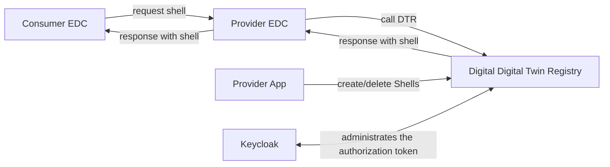
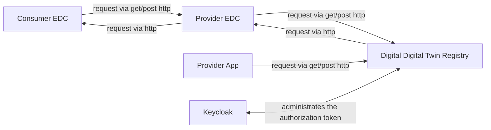

## 3 System scope and context

### Business Context

| Neighbor     | Description                                                       |
|--------------|-------------------------------------------------------------------|
| Consumer EDC | Search for shells                                                 |
| Provider EDC | Retrieve the request from Consumer EDC and calls DTR              |
| Keycloak     | Keycloak is used for token validation                             |
| Provider App | The provider is responsible for the data and create/delete shells |

### Technical Context

| Neighbor         | Description                                                              |
|------------------|--------------------------------------------------------------------------|
| Consumer EDC     | Request for shells to provider EDC                                       |
| Provider EDC     | Request for shells to Digital twin Registry                              |
| Keycloak         | Generates token for users and provides id management of user and service |
| Provider App     | Requests for create/delete shells                                        |

### NOTICE

This work is licensed under the [Apache-2.0](https://www.apache.org/licenses/LICENSE-2.0).

- SPDX-License-Identifier: Apache-2.0
- SPDX-FileCopyrightText: 2023 Robert Bosch Manufacturing Solutions GmbH
- SPDX-FileCopyrightText: 2023 Contributors to the Eclipse Foundation
- Source URL: https://github.com/eclipse-tractusx/sldt-bpn-discovery.git