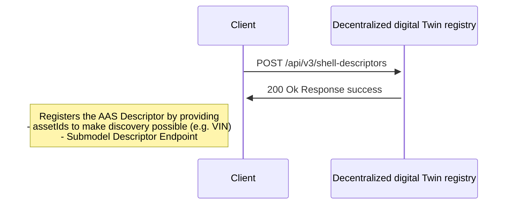
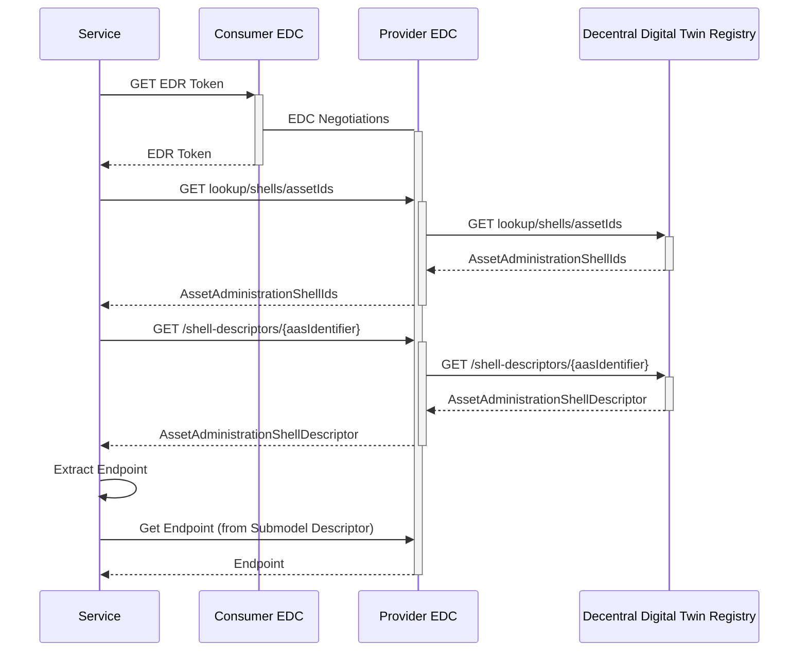

## 4 Runtime-view

### Actors and interaction diagrams
There are two actors who interact with the AAS Registry.

| Actor         | 	Description                                                                                                                                                                                                                                                                                                                                                     | Examples                                                                 |
|---------------|------------------------------------------------------------------------------------------------------------------------------------------------------------------------------------------------------------------------------------------------------------------------------------------------------------------------------------------------------------------|--------------------------------------------------------------------------|
| Data provider | The data provider runs its own Digital Twin Registry and registers AAS Descriptors and Submodel Descriptors so that consumers can query for AAS Descriptors and request data via the Submodel Descriptor Endpoints. Responsibilities: Run own Digital Twin Registry, providing EDC compatible Submodel Descriptor Endpoints, Registration of the AAS Descriptors | Any manufacturer who provides data for their assets and runs its own DTR |
| Data consumer | The data consumers are accessing the AAS Registry to discover and consume data from the Submodel Descriptor Endpoints. Responsibilities: Query the AAS Registry for AAS Descriptors, Access the Submodel Descriptor Endpoints via EDC                                                                                                                            |                                                                          |


The interactions of both actors are shown in the diagrams below.
For the purpose of simplifying, the interactions via EDC is not shown completely.

EDC is involved as following:
1. As a Data Provider to interact with the DTR there is no EDC needed.
2. As a Data Consumer for interactions the EDC is needed.
3. Interactions with Submodel Endpoints (Data Provider) have to be done with EDC

### Data provider
To be able to register a DigitalTwin the following prerequisites must be met.
1. The identifiers for an asset are known (specificAssetIds, e.g. serial number, part id)
2. An endpoint that provides the data for the asset is available. The data has to be compliant with an Aspect Model.
3. To register a twin no EDC is needed. But the DTR is secured by an IDM system, so to register a technical user is needed.

#### Register Twins (simplified without token management by IDM)



### Data Provider

#### Prerequisites
The Digital Twin Registry have to be accessed through an EDC. Following objects are needed to access the registry:

***1. Create Data Asset***
The EDC Data Assets represents the location of the Digital Twin Registry offered by the provider.

| API method     | URL: <PROVIDER_DATAMGMT_URL>/management/v3/assets (POST) |
|----------------|----------------------------------------------------------|
| **Parameters** | none                                                     |
| **Payload**    | see below                                                |
| **Returns**    | 200 / OK                                                 |

***Data Asset***

_note:_ that the "asset:prop:type" is standardized with "data.core.digitalTwinRegistry" for the Digital Twin Registry.

```
{
   "@context":{},
   "@id":"{{ASSET_ID}}",
   "properties":{
      "dct:type":{
         "@id":"cx-taxo:DigitalTwinRegistry"
      }
   },
   "dataAddress":{
      "@type":"DataAddress",
      "type":"HttpData",
      "baseUrl":"{{BACKEND_SERVICE}}",
      "proxyPath":"true",
      "proxyBody":"true",
      "proxyMethod":"true",
      "proxyQueryParams":"true",
      "oauth2:clientId":"{{REGISTRY_CLIENT_ID}}",
      "oauth2:clientSecretKey":"{{REGISTRY_CLIENT_SECRET_KEY}}",
      "oauth2:tokenUrl":"{{REGISTRY_TOKEN_ENDPOINT}}",
      "oauth2:scope":"{{REGISTRY_TOKEN_SCOPE}}"
   }
}
```

***2. Create Policy***

The policy is the BPN policy to give the consumer access to the asset.

| API method     | URL: <PROVIDER_DATAMGMT_URL>/management/v2/policydefinitions (POST) |
   |----------------|---------------------------------------------------|
| **Parameters** | none                                              |
| **Payload**    | see below                                         |
| **Returns**    | 200 / OK                                          |

***EDC Policy***

```
{
    "@context": [
    "https://w3id.org/tractusx/edc/v0.0.1",
    "http://www.w3.org/ns/odrl.jsonld",
    {
        "@vocab": "https://w3id.org/edc/v0.0.1/ns/"
    }
  ],
    "@type": "PolicyDefinition",
    "@id": "{{POLICY_ID}}",
    "policy": {
		"@type": "Policy",
		"permission" : [{
			"action" : "USE",
			"constraint" : {
				"@type": "LogicalConstraint",
				"or" : [{
					"@type" : "Constraint",
					"leftOperand" : "BusinessPartnerNumber",
					"operator" : {
                        "@id": "odrl:eq"
                    },
					"rightOperand" : "{{CONSUMER_BPN}}"
				}]
			}
		}]
    }
}
```

***3. Create Contract Definition***

The contract definition links the created policy with the created asset.

| API method     | URL: <PROVIDER_DATAMGMT_URL>/management/v2/contractdefinitions (POST) | 
   |----------------|--------------------------------------------------------------|
| **Parameters** | none                                                         |
| **Payload**    | see below                                                    |
| **Returns**    | 200 / OK                                                     |


***Contract Definition***

```
{
    "@context": {},
    "@type": "ContractDefinition",
    "accessPolicyId": "{{dtrSourcePolicyId}}",
    "contractPolicyId": "{{dtrSourcePolicyId}}",
    "assetsSelector" : {
        "@type" : "CriterionDto",
        "operandLeft": "https://w3id.org/edc/v0.0.1/ns/id",
        "operator": "=",
        "operandRight": "{{dtrSourceAssetId}}"
    }
}
```

***4. Negotiation***

At last both EDCs do the final negotiation and the consumer EDC receives the edr token to get access to the Digital Twin Registry.


#### Search for Twins (simplified)


### NOTICE

This work is licensed under the [Apache-2.0](https://www.apache.org/licenses/LICENSE-2.0).

- SPDX-License-Identifier: Apache-2.0
- SPDX-FileCopyrightText: 2024 Robert Bosch Manufacturing Solutions GmbH
- SPDX-FileCopyrightText: 2024 Contributors to the Eclipse Foundation
- Source URL: https://github.com/eclipse-tractusx/sldt-digital-twin-registry.git