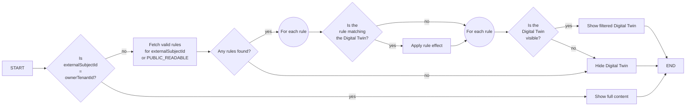
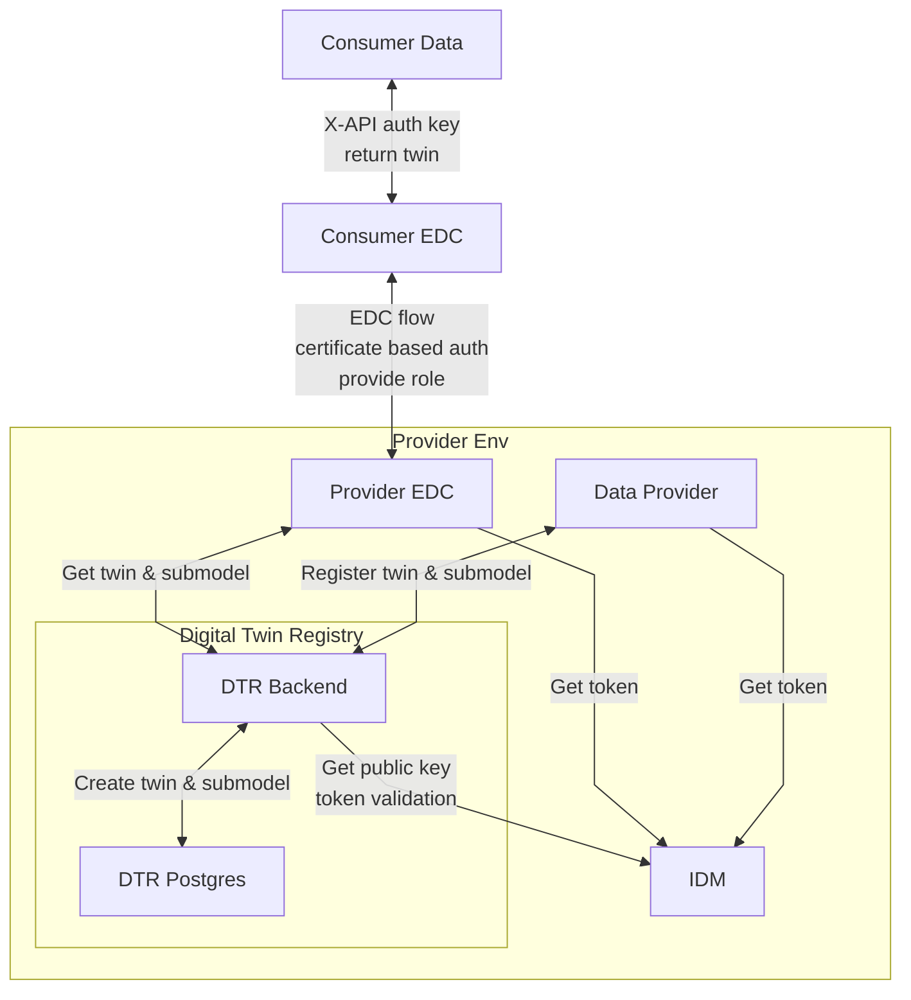

## 6 Crosscutting Concept

### Overall Concept

The overall concept can be found under **2 Architecture and constraints**.

### Asset Administration Shell specification
The Digital Twin Registry has implemented Asset Administration Shell specification in version 3.0.
The corresponding openapi file can be found here: [AAS OPENAPI](../../backend/src/main/resources/static/aas-registry-openapi.yaml)

#### Search by created after

The Asset Administration Shell (AAS) API is enhanced by a timestamp-based search feature for shell-descriptors and lookup shells functionality.
This enhancement allows filtering of AAS Descriptors by their creation date using the new query parameter,`createdAfter`.
The parameter will be optional and the format of the timestamp is `RFC3339` and looks like `YYYY-MM-DDTHH:MM:SSZ`. 
This feature is planned for future integration into the Industrial Digital Twin Association (IDTA) specification.

Please refer the [github issue] 
(https://github.com/orgs/eclipse-tractusx/projects/40/views/7?pane=issue&itemId=88990986&issue=eclipse-tractusx%7Csldt-digital-twin-registry%7C495)

* `GET /shell-descriptors?createdAfter=2025-05-01T00:00:00Z`
* `GET /lookup/shells?createdAfter=2025-05-01T00:00:00Z`

##### Extend Shell

A new parameter `createdDate` will be added to the shell object at the time of creation and will be returned.

```json
{
  ...
  "id": "123",
  "idShort": "model-b1",
  "specificAssetIds": [],
  "createdDate": "2021-01-01T00:00:00Z",
  ...
}

```

### Uniqueness
The following table contains the identifier fields and whether they are globally unique, unique for an
AAS Descriptor or not unique at all.

| Field                                                    | Unique globally | Explanation                                                                                                                                                                                                                                                                                             |
|----------------------------------------------------------|-----------------|---------------------------------------------------------------------------------------------------------------------------------------------------------------------------------------------------------------------------------------------------------------------------------------------------------|
| AssetAdministrationShellDescriptor#id                    | yes             | -                                                                                                                                                                                                                                                                                                       |
| AssetAdministrationShellDescriptor#specificAssetIds#key	 | -               | The specificAssetIds are primarily used for searches. There are use cases where multiple values for the same key can exist. For instance, an OEM can have multiple World Manufacturer Identifier (WMI). Queries against any of the WMI must be possible as data consumers may know only one of the WMI. |
| AssetAdministrationShellDescriptor#submodelDescriptor#id | yes             | -                                                                                                                                                                                                                                                                                                       |

Uniqueness for natural keys e.g. serial numbers is not given in the manufacturing world.
Therefore, the AAS Registry cannot enforce uniqueness for natural keys (specificAssetIds).

### Identifiers

#### Identification and globalAssetId

| Field                                               | Value         | Description                                                                                                                                                                                                                                          |
|-----------------------------------------------------|---------------|------------------------------------------------------------------------------------------------------------------------------------------------------------------------------------------------------------------------------------------------------|
| AssetAdministrationShellDescriptor#id               | Random UUIDv4 | -                                                                                                                                                                                                                                                    |
| AssetAdministrationShellDescriptor#globalAssetId[0] | Random UUIDv4 | The globalAssetId is a natural key that identifies an asset uniquely. An example for instance is the MAC - Address. In the manufacturing industry not all assets do have a global unique natural key. It was decided therefore to use a random UUID. |
| SubmodelDescriptor#id                               | Random UUIDv4 | -                                                                                                                                                                                                                                                    |


### Predefined specificAssetIds
The `specificAssetIds` are collection key-value pairs and the fundamental part for discovery capabilities of the AAS Registry. Data consumers use these specificAssetIds to find AAS Descriptors.
In multiple discussions with different Product Owners and architects, the keys for `specificAssetIds` were defined.
The AAS Registry does not enforce any `specificAssetId key`. However, data providers should use one of these keys if the Asset Administration Shell Descriptor does match one of the defined types e.g. Serial Part, Vehicle.
If you do not find a matching `specificAssetId` key for your use case please contact us so that we can extend the list.

### Submodel Descriptor Endpoints
The Submodel Descriptor contains all the required information to obtain data from a remote address.
The endpoint for a Submodel Descriptor must be setup as follows:

| Property                                                                                                                                                                                                               | Description                                                                                                                                                                                                                                                                        | Example Value                                                                                                                                                                                                 | 
|------------------------------------------------------------------------------------------------------------------------------------------------------------------------------------------------------------------------|------------------------------------------------------------------------------------------------------------------------------------------------------------------------------------------------------------------------------------------------------------------------------------|---------------------------------------------------------------------------------------------------------------------------------------------------------------------------------------------------------------|
| interface                                                                                                                                                                                                              | The type of the endpoint. Only "EDC" is currently supported.                                                                                                                                                                                                                       | EDC                                                                                                                                                                                                           |
| semanticId                                                                                                                                                                                                             | 	The urn of the Semantic Model that describes the data of this endpoint.                                                                                                                                                                                                           | urn:bamm:com.catenax:1.0.0#ExampleModel                                                                                                                                                                       |
| protocolInformation#href                                                                                                                                                                                               | The EDC compatible endpoint where the semanticId compatible data can be fetched.  Catena-X  defined the URL structure as: Read Endpoint: http://<HOST>/<BPN>/<AAS_ID>-<SUBMODEL_ID>/submodel?content=value Operations Endpoint: <SAME_AS_READ/<operationName>/invoke?content=value | Read Endpoint: http://myawesomeconnector.com/BPNL7588787849VQ/urn%3Auuid%3Ac227a880-b82b-40f7-846c-3942ddf26c29-urn%3Auuid%3A53125dc3-5e6f-4f4b-838d-447432b97918/submodel?content=value&extent=WithBLOBValue |
| Operation Endpoint: http://myawesomeconnector.com/BPNL7588787849VQ/urn%3Auuid%3Ac227a880-b82b-40f7-846c-3942ddf26c29-urn%3Auuid%3A53125dc3-5e6f-4f4b-838d-447432b97918/submodel/vin-van-converter/invoke?content=value |                                                                                                                                                                                                                                                                                    |                                                                                                                                                                                                               |
| protocolInformation#endpointProtocol                                                                                                                                                                                   | The protocol of the endpoint.                                                                                                                                                                                                                                                      | HTTPS                                                                                                                                                                                                         |
| protocolInformation#endpointProtocolVersion                                                                                                                                                                            | The version of the protocol.                                                                                                                                                                                                                                                       | 1.0                                                                                                                                                                                                           |

### Authentication & Authorization
The AAS Registry needs to be integrated with an OAuth2 compliant authorization server. Every API call has to provide a valid Bearer Token issued by this authorization server.
Authorization is supported by Role Based Access Control (RBAC). Following roles are available:

| Role                    | Description                                              | 
|-------------------------|----------------------------------------------------------|
| view_digital_twin       | Can read all digital twins.                              |
| add_digital_twin        | Can add a digital twin.                                  |
| update_digital_twin     | Can update a digital twin.                               |
| delete_digital_twin     | Can delete a digital twin.                               |
| submodel_access_control | Can perform submodel access control authorization calls. |
| read_access_rules       | Can read the rules defined for access control.           |
| write_access_rules      | Can write the rules defined for access control.          |

Depending on being a Data Provider or a Data Consumer there are different tokens for authentication and authorization needed.
#### Data Provider
1. technical user for the service which administrates the Digital Twin Registry
2. technical user for the EDC which makes the requests in behalf of the Data Consumer to the DTR.

#### Data Consumer
1. needs an EDR token which is provided between the intercommunication between the EDCs.

#### AWS Cognito as Identity Provider
DTR can support Keycloak and AWS Cognito as an Identity Provider for all clients that want to access the registry.
Client must fetch a token and send it together with the request.
Cognito behaves somehow different than Keycloak so some code modifications were necessary to use Cognito as an Identity Provider for DTR.
Detailed information can be found [here](COGNITO.md)

### Authentication on behalf of a user
The AAS Registry can be accessed on behalf of a user. The token has to be obtained via the OpenID Connect flow. The AAS Registry will validate these tokens.
*Support contact*	tractusx-dev@eclipse.org

### Access control to Digital Twins Based on the BPN (Business Partner Number)/ TenantId

#### Classic implementation

The visibility of `specificAssetIds` in the Digital Twin Registry based on the Business Partner Number (BPN) (Which is send via header Edc-Bpn) can be controlled with the attribute `externalSubjectId`. Hence, the `externalSubjectId` is identified with the BPN.
The communication between consumer and provider is via EDC. Before the provider EDC sends the request to the DTR, the property Edc-Bpn with the BPN of the consumer will be set by the provider EDC.


* The BPN as attribute to a *specificAssetId* can be optionally provided in `specificAssetIds`. This can be done with `externalSubjectId`.
* Only those users, where `externalSubjectId` matches the Eclipse Dataspace Components-Header (Edc-Bpn -> *i.e.* BPN) are able to discover and read exactly this content of `specificAssetIds`.
* The behavior is **closed by default**, *i.e.*, if no `externalSubjectId` is defined to a `specificAssetId`, the content of this particular `specificAssetId` (key, value) is only visible for the owner of the *Digital Twin* (also known as data provider).
* To mark a `specificAssetId` as public for every reader on a *Digital Twin*, the defined characters (`"PUBLIC_READABLE"`) need to be added in the `externalSubjectId`.
    * *Cave: The publisher of `specificAssetIds` needs to consider antitrust law. This use of `"PUBLIC_READABLE"` is only allowed for the *specificAssetId* `"assetLifecyclePhase"` and `"manufacturerPartId"` (which is technically enforced by the Digital Twin Registry) if its content describes material numbers of products and those products are or were in serial production for the open market. If its content describes material numbers of products in state of, *e.g.*, pre-production, being planned for production, being unsold, the use of `"PUBLIC_READABLE"` is not allowed and use of dedicated read access via  `externalSubjectId` is to be used instead. `"manufacturerPartId"` is not allowed to be used for different content than the one described here.*
* The behavior of the Digital Twin Registry is as follows. The read-access from `specificAssetIds` is inherited by the other fields of a *Digital Twin*.
    * An owner and a user with respect to the BPN, who has read-access to one of the `specificAssetIds` (`externalSubjectId` has `"value":"<Business Partner Number>"`) has read-access to the other fields of a *Digital Twin* as well, *i.e.* (see the full list of fields [POST Asset Administration Shell Descriptor v3.0 SSP-001](https://app.swaggerhub.com/apis/Plattform_i40/AssetAdministrationShellRegistryServiceSpecification/V3.0_SSP-001#/Asset%20Administration%20Shell%20Registry%20API/PostAssetAdministrationShellDescriptor))
        * `description`
        * `displayName`
        * `administration`
        * `assetKind`
        * `assetType`
        * `globalAssetId`
        * `idShort`
        * `id`
        * `submodelDescriptors`
        * `specificAssetIds`

    * A user, who has <u>only</u> general read-access to `specificAssetIds` (`externalSubjectId` has `"value":"PUBLIC_READABLE"`) has <u>only</u> read-access to the following fields of a *Digital Twin*
        * `id`
        * `submodelDescriptors`
        * `specificAssetIds`
    * The list of `keys` in the externalSubjectId is filtered for the requested user. Only the keys will be returned where the BPN matched.

**Hint** <br>
The defined string for `"PUBLIC_READABLE"` and the list of allowed types to mark as public is configurable via helm values.yml:
* `registry.externalSubjectIdWildcardPrefix` (Default is `"PUBLIC_READABLE"` )
* `registry.externalSubjectIdWildcardAllowedTypes` (Default is `"manufacturerPartId,assetLifecyclePhase"` )

Detailed information can be found [here](../INSTALL.md)
_________________


Example to create a *Digital Twin* with `specificAssetIds`:
```
POST Method:
{{registry-baseurl}}/api/v3/shell-descriptors
```

```json
POST Body (JSON):
{
   "idShort":"idShortExample",
   "id":"e1eba3d7-91f0-4dac-a730-eaa1d35e035c-2",
   "description":[
      {
         "language":"en",
         "text":"Example of human readable description of digital twin."
      }
   ],
   "specificAssetIds":[
      {
         "name":"partInstanceId",
         "value":"24975539203421"
      },
      {
         "name":"customerPartId",
         "value":"231982",
         "externalSubjectId":{
            "type":"ExternalReference",
            "keys":[
               {
                  "type":"GlobalReference",
                  "value":"BPN_COMPANY_001"
               }
            ]
         }
      },
      {
         "name":"manufacturerId",
         "value":"123829238",
         "externalSubjectId":{
            "type":"ExternalReference",
            "keys":[
               {
                  "type":"GlobalReference",
                  "value":"BPN_COMPANY_001"
               },
               {
                  "type":"GlobalReference",
                  "value":"BPN_COMPANY_002"
               }
            ]
         }
      },
      {
         "name":"manufacturerPartId",
         "value":"231982",
         "externalSubjectId":{
            "type":"ExternalReference",
            "keys":[
               {
                  "type":"GlobalReference",
                  "value":"PUBLIC_READABLE"
               }
            ]
         }
      }
   ],
   "submodelDescriptors":[
      {
         "endpoints":[
            {
               "interface":"SUBMODEL-3.0",
               "protocolInformation":{
                  "href":"https://edc.data.plane/mypath/submodel",
                  "endpointProtocol":"HTTP",
                  "endpointProtocolVersion":[
                     "1.1"
                  ],
                  "subprotocol":"DSP",
                  "subprotocolBody":"body with information required by subprotocol",
                  "subprotocolBodyEncoding":"plain",
                  "securityAttributes":[
                     {
                        "type":"NONE",
                        "key": "NONE",
                        "value": "NONE"
                     }
                  ]
               }
            }
         ],
         "idShort":"idShortExample",
         "id":"cd47615b-daf3-4036-8670-d2f89349d388-2",
         "semanticId":{
            "type":"ExternalReference",
            "keys":[
               {
                  "type":"Submodel",
                  "value":"urn:bamm:io.catenax.serial_part_typization:1.1.0#SerialPartTypization"
               }
            ]
         },
         "description":[
            {
               "language":"de",
               "text":"Beispiel einer lesbaren Beschreibung des Submodels."
            },
            {
               "language":"en",
               "text":"Example of human readable description of submodel"
            }
         ]
      }
   ]
}
```
This example is a *Digital Twin* with four different `specificAssetIds` as descriptors.
* `partInstanceID` is discoverable and visible only for the owner of the *Digital Twin*, since <u>no</u> `externalSubjectId` is defined.
* `customerPartId` is discoverable and visible only for the owner of the *Digital Twin* and an (external) reader via EDC, who has the bpn-value "BPN_COMPANY_001" in the header of the EDC
* `manufacturerId` is discoverable and visible only for the owner of the *Digital Twin* and two (external) readers via EDC, who have the bpn-value "BPN_COMPANY_001" and "BPN_COMPANY_002" in the header of the EDC
* `manufacturerPartId` is discoverable and visible for everyone, who has access to the Digital Twin Registry, because the `externalSubjectId` has the value `"PUBLIC_READABLE"` included.

For example, if an (external) reader via EDC requests the here shown *Digital Twin* and the edc-bpn header includes the bpn-value "BPN_COMPANY_001", the list of `specificAssetIds` contains three entries, namely:
* `customerPartId`
* `manufacturerId`
* `manufacturerPartId`

In consequence, the reader "BPN_COMPANY_001", as well as the reader "BPN_COMPANY_002" and the owner of this *Digital Twin* has full read access to the other fields of this *Digital Twin*, *i.e.* `idShort`, `id`, `description`, and `submodelDescriptors`.

In this example, the `specificAssetId` `"name": "partInstanceId"` is filtered out, because it is only visible for the owner of the *Digital Twin*.

Any (external) readers with respect to the `"PUBLIC_READABLE"` flag at `specificAssetId` `"name": "manufacturerPartId"`, have access to the fields
* `id`
* `submodelDescriptors`

of this *Digital Twin*.

#### Granular access control implementation

The granular access control implementation is provided as an alternative option to enforce visibility rules of the *Digital Twin* details. These can be:

1. The visibility of the *Digital Twin* as a whole
2. The visibility of certain `specificAssetId` names and values of the *Digital Twin*
3. The visibility of certain `submodelDescriptors` of the *Digital Twin*
4. Restricting access to *Digital Twin* details which are `"PUBLIC_READABLE"`
   (only showing the `id`, the public readable `specificAssetId` names and values, the `createdDate` and the filtered `submodelDescriptors` )

> [!NOTE]
> We have created an EDC extension to let you leverage the benefits of granular access control to the full extent. Please read the related details [here](EDC-extension-configuration.md)!

##### Configuring granular access control

To enable granular access control (instead of the classic implementation), the `registry.useGranularAccessControl` configuration HELM chart property must be set to `"true"`.
This will in turn set `registry.use-granular-access-control` Spring property to `true`, which will activate the granular access control.

In addition to the aforementioned property, we can set the number of records fetched when listing records. This can be done by setting the
`registry.granularAccessControlFetchSize` HELM chart property. The default value is `"500"`. Providing this property will set the `registry.granular-access-control-fetch-size`
Spring property of the Digital Twin Registry to the equivalent int value. In general, the higher we can set this value, the fewer fetches will be required when shells are
listed and filtered. It is recommended to use at least 1000 if the registry has more than 100 000 Digital Twins.

##### Creating an access rule

The access rules can be managed using the provided access rule API ([See API specs here](../access-control-service-sql-impl/src/main/resources/static/access-control-openapi.yaml)).

> [!NOTE]
> In order to use the API, the client must have the `read_access_rules` and `write_access_rules` roles.

Please refer to the following table to get familiar with the schema of the access rules.

| Property    | Type     | Required on create | Description                                                                            |
|-------------|----------|--------------------|----------------------------------------------------------------------------------------|
| id          | long     | No (read-only)     | The auto-incremented Id of the rule.                                                   |
| tid         | string   | No (read-only)     | The Id of the owner tenant (the owner of the Digital Twin Registry).                   |
| policyType  | enum     | Yes                | Defines the policy language used for the rule's policy. Possible values: `AAS`.        |
| policy      | json     | Yes                | The definition of the access rule.                                                     |
| description | string   | No (optional)      | An short, optional description or note to help with the maintenance of the rule.       |
| validFrom   | datetime | No (optional)      | An optional timestamp representing the earlier time when the rule should be in effect. |
| validTo     | datetime | No (optional)      | An optional timestamp representing the latest time when the rule should be in effect.  |

An example policy:

```json
{
   "id": 1,
   "tid": "00000000-1111-2222-3333-444444444444",
   "policyType": "AAS",
   "policy": {
      "accessRules": [
         {
            "attribute": "bpn",
            "operator": "eq",
            "value": "BPNL00000000000A"
         },
         {
            "attribute": "mandatorySpecificAssetIds",
            "operator": "includes",
            "values": [
               {
                  "attribute": "manufacturerPartId",
                  "operator": "eq",
                  "value": "99991"
               },
               {
                  "attribute": "customerPartId",
                  "operator": "eq",
                  "value": "ACME001"
               }
            ]
         },
         {
            "attribute": "visibleSpecificAssetIdNames",
            "operator": "includes",
            "values": [
               {
                  "attribute": "name",
                  "operator": "eq",
                  "value": "manufacturerPartId"
               },
               {
                  "attribute": "name",
                  "operator": "eq",
                  "value": "customerPartId"
               },
               {
                  "attribute": "name",
                  "operator": "eq",
                  "value": "partInstanceId"
               }
            ]
         },
         {
            "attribute": "visibleSemanticIds",
            "operator": "includes",
            "values": [
               {
                  "attribute": "modelUrn",
                  "operator": "eq",
                  "value": "Traceabilityv1.1.0"
               },
               {
                  "attribute": "modelUrn",
                  "operator": "eq",
                  "value": "ProductCarbonFootprintv1.1.0"
               }
            ]
         }
      ]
   },
   "description": "Access rule description.",
   "validFrom": "2024-01-02T03:04:05Z",
   "validTo": "2024-06-07T08:09:10Z"
}
```

The example policy above can be split into multiple parts when read.

1. Validity - It is valid between `2024-01-02T03:04:05Z` and `2024-06-07T08:09:10Z`. Otherwise, it is ignored.
2. Scope - Outlining when a rule is applicable.
    1. The first access rule (`$.policy.accessRules[0]`) defines the *bpn* (*externalSubjectId*) of the tenant to whom the policy applies.
    2. The second access rule (`$.policy.accessRules[1]`) defines the *mandatorySpecificAssetIds* which must be present in the *Digital Twin* in order for the rule to be applicable. The rule will become applicable only if __all__ *specificAssetId* name-value pairs of the rule are present in the *Digital Twin*.
3. Effect - Defines which parts of the matching *Digital Twins* should be visible when the client's *externalSubjectId* matches the rule's.
    1. The third access rule (`$.policy.accessRules[2]`) defines the *visibleSpecificAssetIdNames*. When the rule matches, the *specificAssetIds* from the
       *Digital Twin* with these names should be visible using one of the cases below:
        1. When the same name is present as a name in the *mandatorySpecificAssetIds* and the *visibleSpecificAssetIdNames*, then the rule will only make a
           *specificAssetId* from the *Digital Twin* when the *specificAssetId* is listed as an item of the *mandatorySpecificAssetIds*.
        2. Otherwise, if the name is only present as a *visibleSpecificAssetIdNames* without being present on the *mandatorySpecificAssetIds* as well, the rule
           will make visible any *specificAssetId* from the *Digital Twin* if the name of the *specificAssetId* matches the name from the *visibleSpecificAssetIdNames*,
           regardless of the value of the *specificAssetId* in the *Digital Twin*.
    2. The fourth access rule (`$.policy.accessRules[3]`) defines the *visibleSemanticIds*. These *semanticIds* are identifying the *submodelDescriptors* from the *Digital Twin* which should be visible when the rule matches.

##### How the rule evaluation works?

In general, when a shell's visibility is evaluated, we must:

1. Take the *externalSubjectId* of the client, the *ownerTenantId* of the *Digital Twin Registry* and the contents of the *Digital Twin* in question.
2. If the *externalSubjectId* is equal to the *ownerTenantId*, the client can see the full content.
3. Otherwise, we must fetch all access rules which belong to the client's *externalSubjectId* or `PUBLIC_READABLE`; and is in the specified validity period
4. Then, for each *specificAssetId* of the *Digital Twin*, we must verify whether there is at least one applicable rule that gives access to the *specificAssetId* of the *Digital Twin*.
5. Similarly, for each *submodelDescriptor* of the *Digital Twin*, we must verify whether there is at least one applicable rule that gives access to the *semanticId* of the *submodelDescriptor* from the *Digital Twin*.

The process acn be summed up in a more visual way as shown in the diagram below:



###### Lookup shells - `GET {{baseUrl}}/api/v3/lookup/shells?assetIds=...`

In case of the lookup shells, the filtering and access control of the *Digital Twins* is done using the following steps:

1. A page (fetchSize) of *Digital Twins* is loaded which are matching the client's query expression.
2. The list of shells fetched in the previous step is filtered by applying the access control rules to them one-by-one.
3. The process is repeated until we have the desired number of *Digital Twins* or there are no more *Digital Twins* to fetch.
4. The AAS Ids of the visible *Digital Twins* are returned.

###### Get all shells - `GET {{baseUrl}}/api/v3/shell-descriptors`

The process is similar to the lookup shells, the filtering and access control of the *Digital Twins* is done as follows:

1. A page (fetchSize) of *Digital Twins* is loaded.
2. The list of shells fetched in the previous step is filtered by applying the access control rules to them one-by-one.
3. The process is repeated until we have the desired number of *Digital Twins* or there are no more *Digital Twins* to fetch.
4. The visible properties of the visible *Digital Twins* are returned.
    1. If the list of *specificAssetIds* in the shell has *multiple* entries with the same name, then the following rules apply:
        1. Usecase 1: A rule includes a specificAssetId (for example customerPartId=123) as *mandatorySpecificAssetId and visibleSpecificAssetId*. The Shell has multiple entries with the same name and *one of the entry* matched the value from mandatorySpecificAssetId, then only the matched entry is visible.
        2. Usecase 2: A rule includes a specificAssetId (for example customerPartId=123) as *mandatorySpecificAssetId and visibleSpecificAssetId*. The Shell has multiple entries with the same name and *none of the entries* matched the value from mandatorySpecificAssetId, then no entries with the same name is visible.

###### Get Shell by AAS Id - `GET {{baseUrl}}/api/v3/shell-descriptors/:aasIdentifier`

To determine the visibility of a single *Digital Twin*, we can simply:

1. Fetch the *Digital Twin*
2. Apply the access control rules using the process defined at the beginning of this section
3. Return the visible parts of the *Digital Twin* (or empty result in case the *Digital Twin* is not visible at all)

#### Public readable

When a *Digital Twin* is only visible because there are applicable `PUBLIC_READABLE` rules which make certain properties visible,
the shell details are further limited. This means, that we are returning only:

- the `id`,
- the `idEsternal` (*AAS Id*),
- the public readable `specificAssetId` names and values,
- the `createdDate`
- the filtered `submodelDescriptors`

### Security Assessment

Data flow diagram:




### NOTICE

This work is licensed under the [Apache-2.0](https://www.apache.org/licenses/LICENSE-2.0).

- SPDX-License-Identifier: Apache-2.0
- SPDX-FileCopyrightText: 2024 Robert Bosch Manufacturing Solutions GmbH
- SPDX-FileCopyrightText: 2024 Contributors to the Eclipse Foundation
- Source URL: https://github.com/eclipse-tractusx/sldt-digital-twin-registry.git